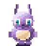
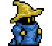

# ai-buddy

A desktop companion in the spirit of Windows 95-era desktop mascots. An animated sprite lives on your screen, reacts to windows around it, and can be asked to do real work on your machine.

<p align="center">
  
</p>

[](https://github.com/omesser/ai-buddy/actions/workflows/tests.yml)
[](./LICENSE)


## What It Does

- **Perches on windows.** Falls, lands on window edges, rides them when dragged slowly, drops when yanked or closed.
- **Reacts to you.** Click to poke, drag to pick up, fling to throw. It arcs, lands, and keeps going.
- **Click-through off the sprite.** Clicks on transparent regions reach the window underneath.
- **Stays out of your way.** Fades when you go fullscreen, hides instantly on Control-Option-Command-B, never appears in screen captures or shares.
- **Lives its own life.** Walks, idles, sits, sleeps. Static weights pick behaviors, or hook up a Director (OpenAI, Anthropic, xAI, Ollama) for ambient proposals.

## See It

**Try the interactive demos:**
- [Buddy Cues](https://omesser.github.io/ai-buddy/cues.html) — Gestures and physics on a draggable sprite
- [Chat Mockups](https://omesser.github.io/ai-buddy/chat-mockups.html) — Three chat surface designs (chat not shipped yet — [#17](https://github.com/omesser/ai-buddy/issues/17))

## Interact

- **Poke:** Click once. It plays its `react` animation, then goes back to what it was doing.
- **Pick up:** Click and drag. It follows your cursor.
- **Throw:** Drag and release while moving. It leaves your hand on an arc and lands.
- **Perch:** Let it settle on a window's top edge. Drag that window slowly and it rides along. Fling the window and it drops.
- **Hide hotkey:** Control-Option-Command-B. Instant. Press again to bring it back.
- **Fullscreen:** The sprite fades out when any application goes fullscreen, fades back in when you exit.

## Characters

Buddy Bot ships as the default. Each character moves and behaves differently.

| Character | Style | Notes |
|---|---|---|
|  **Buddy Bot** | Logo mascot, smooth render | Helpful, curious, treats the desk like a shared workspace. Greets, strolls, settles into nap. |
|  **Nim** | Modern pixel art | Pixel grid, translucent shadow. Twice the frames, so motion eases. Sits and sleeps. |
|  **Black Mage** | 8-bit Theater fan art | Pixel art at 3x scale. Stands, never settles. |

Character Packages bundle identity, art, personality, and tuning. Three ship; the format is first-class but undocumented until v2.

## Run From Source

macOS is the first implementation. Linux is supported with a degraded Spatial Layer under Wayland (no window geometry). Windows is out of v1 scope.

```sh
git clone https://github.com/omesser/ai-buddy.git
cd ai-buddy
cargo run -p ai-buddy
```

No packaged installers yet — tracked in [#132](https://github.com/omesser/ai-buddy/issues/132).

**Switch characters:**

```sh
cd src-tauri && AI_BUDDY_CHARACTER=buddy-bot cargo run
cd src-tauri && AI_BUDDY_CHARACTER=nim cargo run
cd src-tauri && AI_BUDDY_CHARACTER=black-mage cargo run
```

## Director (Optional)

With no Director key the sprite still has a life: Static weights pick among the Character's declared Behaviors. A key turns on the HTTP stand-in ([ADR-0008](./docs/adr/0008-one-harness-session.md)).

OpenAI, Anthropic, and Ollama use `/v1/chat/completions`. [xAI](https://docs.x.ai/developers/model-capabilities/text/comparison) uses `/v1/responses`.

| Variable | What it does |
|---|---|
| `AI_BUDDY_DIRECTOR_API_KEY` | Required for remote providers. Optional for local servers. |
| `AI_BUDDY_DIRECTOR_BASE_URL` | Provider origin. Default `https://api.openai.com`. |
| `AI_BUDDY_DIRECTOR_MODEL` | Model name. Default `gpt-4o-mini`. |

```sh
# OpenAI
cd src-tauri
AI_BUDDY_DIRECTOR_API_KEY="$OPENAI_API_KEY" \
AI_BUDDY_DIRECTOR_BASE_URL=https://api.openai.com \
AI_BUDDY_DIRECTOR_MODEL=gpt-4o-mini \
cargo run

# Ollama (local, no key)
cd src-tauri
AI_BUDDY_DIRECTOR_BASE_URL=http://localhost:11434 \
AI_BUDDY_DIRECTOR_MODEL=gemma4 \
cargo run
```

See [DEVELOPMENT.md](./docs/DEVELOPMENT.md) for the full Director env table and local model server setup.

## Platform Support

What ships where, read from the platform seam rather than from intent. Honest about degraded and stub cells.

| Capability | macOS | Linux | Windows |
|---|---|---|---|
| Overlay that never takes focus | yes | yes † | degraded |
| Click-through off the sprite | yes | yes † | yes |
| Grab, Throw and Poke | yes | yes † | degraded |
| Perch on window edges | yes | yes † | degraded |
| Dock or panel as a Perch | yes | degraded | degraded |
| Fade out for a fullscreen app | yes | yes † | degraded |
| Never captured in a screen share | yes | degraded | stub |

- `yes` — implemented.
- `degraded` — runs in reduced form. A supported mode, not an error.
- `stub` — the arm compiles and does nothing. Windows only.
- `†` — needs an X server (usually XWayland). See [DEVELOPMENT.md](./docs/DEVELOPMENT.md).

## Developing

See [DEVELOPMENT.md](./docs/DEVELOPMENT.md) for:
- Toolchains (Rust, Python, Node)
- Pre-commit hooks
- Verifying the overlay (unit tests, `verify-overlay.sh`, 23-step human checklist)
- Trace variables (HITTEST, FRAMES, DIRECTOR, ENGINE)
- Character Packages (search paths, AI_BUDDY_CHARACTERS env)
- Importing a pet from petscodex or Shimeji-ee
- Running several buddies at once

**Design and decisions:**
- [CONTEXT.md](./CONTEXT.md) — Vocabulary
- [DESIGN.md](./DESIGN.md) — Design decisions
- [docs/SPEC.md](./docs/SPEC.md) — v1 scope and requirements
- [docs/adr/](./docs/adr/) — Architecture Decision Records

## Prior Art and Attribution

[WindowPet](https://github.com/SeakMengs/WindowPet) (MIT) is the reference for a Tauri desktop pet. ai-buddy is a greenfield build rather than a fork, for the reasons in [ADR-0001](./docs/adr/0001-greenfield-tauri-not-fork-windowpet.md). The overlay is an independent implementation. The tray, launch-at-login, and updater follow WindowPet's shape under MIT.

Character art provenance is documented in each Character Package manifest.

## License

MIT.
