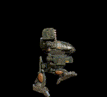
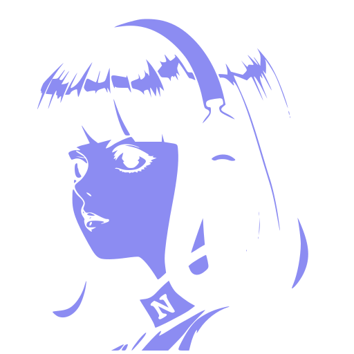

<div align="center">

# ai-buddy

<!-- Shields split on a single hyphen, so cursor-agent is cursor--agent in the URL. Each color is that harness's own hue, darkened until the white shield text stays readable. -->

[](https://github.com/omesser/ai-buddy/actions/workflows/tests.yml) [](./LICENSE)

[](#harness-support) [](#harness-support) [](#harness-support) [](#harness-support) [](#harness-support) [](#harness-support) [](#harness-support)

</div>

---

A desktop mascot that lives on your screen — and acts in character.

Pick a Character with an authored personality. The Director chooses idle Behaviors and short spoken lines to match. It also perches on windows, reacts to gestures, and stays out of your way while you work.

<p align="center">
  
</p>


## What It Does

- **Personality-driven AI.** Each Character ships with a `personality.txt`. The Director uses it to pick idle Behaviors and short dialogue. Works offline with Static weights; optionally connect a model (API key or local) for more variety.
- **Perches on windows.** Falls, lands on a window's top edge, rides a slow drag, drops when you yank or close the window.
- **Reacts to gestures.** Poke, pick up, throw — it arcs, lands, and keeps going.
- **Stays out of your way.** Fades for fullscreen, hides on Control-Option-Command-B. Appears in screenshots by default; opt-out available in settings.
- **Lives its own life.** Walks, idles, sits, sleeps — even with the Director off.
- **Never reads your screen.** Sensing is window metadata, never pixels: no screenshots, no OCR. An agent that needs to see and act on your desktop gets that from its Harness or an MCP server you attach — see [Computer use](#computer-use).

## See It

Try [Buddy Cues](https://omesser.github.io/ai-buddy/cues.html) — gestures and physics on a draggable sprite in the browser.

## Interact


- **Poke** — click once for a react, then it resumes.
- **Summon** — double-click to open a chat window for that buddy.
- **Pick up** — click and drag; it follows the cursor.
- **Throw** — release while moving; it flies on an arc and lands.
- **Perch** — let it settle on a window's top edge; drag slowly to ride, fling to drop.
- **Hide** — Control-Option-Command-B toggles the buddy instantly.
- **Fullscreen** — fades out for fullscreen apps, fades back when you exit.

### Talk to it

Summon opens a chat window belonging to that buddy. What you type is another
turn in the same conversation that decides what it does on your desktop, so an
answer arrives as speech in the bubble and as a Behavior it plays, not only as
text. Lines it says when nobody asked appear here too, labelled with what it was
reacting to.


The bar along the bottom names what the buddy is doing right now — the Behavior,
the Primitive under it, the Animation playing, its State, and how long until it
next thinks. It needs a Director; see [Running it](#running-it).

## Characters

Buddy Bot is the default. Eight Characters ship in the repo; each moves and speaks differently.

| Character | Description | Personality |
|---|---|---|
| <br>**Buddy Bot** | Logo mascot. Smooth 90×90 render. | Friendly, curious, treats the desk like a shared workspace. [full prompt](./characters/buddy-bot/personality.txt) |
| <br>**Black Mage** | FF1 Black Mage from 8-Bit Theater. Pixel art, scaled up for the desktop. | Cynical spellcaster. Cryptic, theatrical, more comfortable with incantations than conversation. [full prompt](./characters/black-mage/personality.txt) |
| <br>**BMO** | Small games console (Shimeji shop pack). Soft drawn lines. | Earnest and childlike, delighted to be here, eager to help. [full prompt](./characters/bmo/personality.txt) |
| <br>**Cat** | Scottish Fold, chibi gray-and-white. | Treats every window as furniture. Busy, curious, never generic, never helpful. [full prompt](./characters/cat/personality.txt) |
| <br>**Jotaro Kujo** | Chibi JoJo delinquent (petscodex import). | Terse, perpetually bored, tougher than his indifference suggests. [full prompt](./characters/jotaro-kujo/personality.txt) |
| <br>**Nim** | Modern pixel art with a soft shadow. | Sleeps eleven hours a day. Soft-spoken, easily charmed, slow to arrive anywhere. [full prompt](./characters/nim/personality.txt) |
| <br>**Timber Wolf** | BattleTech OmniMech (Sketchfab model by [MekaRamen](https://mekaramen.com/), permitted derivative). | Patrol mech. Desktop is a sector to secure, reports are brief. Clan warriors don't waste words. [full prompt](./characters/timber-wolf/personality.txt) |
| <br>**Trump** | Caricature in a navy suit and red tie. | The desktop is his rally. Bombastic, sure this is the greatest desktop in history. [full prompt](./characters/trump/personality.txt) |

Characters are packages of art, personality, and tuning. Packaging details live in [DEVELOPMENT.md](./docs/DEVELOPMENT.md); the on-disk format is still evolving.

## Install

Download a build from [GitHub Releases](https://github.com/omesser/ai-buddy/releases).

Or clone and run from the repo root (macOS, Linux, Windows):

```sh
git clone https://github.com/omesser/ai-buddy.git
cd ai-buddy
cargo run -p ai-buddy
```

### macOS

Apple Silicon. The Release ships a `.dmg`. Open it and copy `ai-buddy` to Applications.

The build is ad-hoc signed, not notarized, so Gatekeeper will warn on the first open. Double-click the app, dismiss the dialog, then System Settings → Privacy & Security → Open Anyway. Note the button is time-limited after the blocked launch. Notarization is a follow-up.

The same missing signature costs two Keychain dialogs at launch — "ai-buddy wants to use your confidential information stored in ai-buddy" — for anyone who saved a Director API key. An ad-hoc signature has no identity, so macOS records the app in the key's access list as a hash of that exact build, and the next release is a different hash and a stranger to its own key. Always Allow answers both, and holds until the next update replaces the hash. Exporting `AI_BUDDY_DIRECTOR_API_KEY` keeps the Keychain out of the launch entirely. A stable signing identity is what ends it ([#283](https://github.com/omesser/ai-buddy/issues/283)).

### Linux

The Release ships an AppImage and a `.deb` (x86_64).

Under Wayland the sprite keeps to screen edges and loses window Perches — a supported mode, not an error. X11 gets both.

```sh
# Debian/Ubuntu .deb
sudo apt install ./ai-buddy_*.deb
# or: AppImage (needs libfuse2 on Ubuntu 22.04, libfuse2t64 on 24.04+)
# sudo apt install libfuse2    # or libfuse2t64
# chmod +x ai-buddy_*.AppImage && ./ai-buddy_*.AppImage
```

Tray hosts, cue audio (GStreamer), and AppImage fuse notes: [DEVELOPMENT.md](./docs/DEVELOPMENT.md#linux-dependencies).

### Windows

The Release ships an NSIS installer (x86_64). Run it and follow the prompts.

SmartScreen may warn on the first open because the build is not Authenticode signed. Choose More info → Run anyway. Code signing is a follow-up.

## Running it

**Works offline.** With no API key, Static weights pick idle Behaviors from the Character. No model, no account required.

**Optional Model API.** Point Settings → AI (or env vars) at OpenAI, Anthropic, Ollama, or any OpenAI-compatible `/v1/chat/completions` endpoint:

```sh
# OpenAI (or export env vars to persist)
AI_BUDDY_DIRECTOR_API_KEY="$OPENAI_API_KEY" \
AI_BUDDY_DIRECTOR_BASE_URL=https://api.openai.com \
AI_BUDDY_DIRECTOR_MODEL=gpt-4o-mini \
cargo run -p ai-buddy

# Ollama (local, no key)
AI_BUDDY_DIRECTOR_BASE_URL=http://localhost:11434 \
AI_BUDDY_DIRECTOR_MODEL=gemma4 \
cargo run -p ai-buddy
```

**Optional Harness.** An agent you already run answers instead, over ACP, and signs in on its own:

```sh
AI_BUDDY_HARNESS=claude cargo run -p ai-buddy   # names and standing below
```

**Switch characters** (env or Settings):

```sh
# Any of: buddy-bot (default), black-mage, bmo, cat, jotaro-kujo, nim, timber-wolf, trump
AI_BUDDY_CHARACTER=nim cargo run -p ai-buddy
```

See [DEVELOPMENT.md](./docs/DEVELOPMENT.md) for provider details, Director env vars, local model servers, keyring/secret store, and `probe-model.sh`.

## Harness Support

Which Harness you attach changes what ai-buddy can do with it.
Named rows are smoked with `scripts/probe-harness.sh` (see [DEVELOPMENT.md](./docs/DEVELOPMENT.md)); the run itself lives on the issue that did it.

`codex` and `goose` carry no mark. Simple Icons has neither, and neither vendor
grants one: OpenAI's guidelines say not to use the logo without permission, and
Block ships Goose under Apache 2.0, whose section 6 withholds trademark rights.
#1021 tracks it.

| Harness | Command | Standing |
|---|---|---|
|  `claude` | `npx -y @agentclientprotocol/claude-agent-acp@latest` | Zed's adapter over the Claude Agent SDK; no first-party ACP mode. Fresh and resumed sessions both work. |
| `codex` | `npx -y @agentclientprotocol/codex-acp@latest` | Zed's adapter (`codex-acp`); no first-party ACP mode. Fresh and resumed sessions both work. |
|  `copilot` | `copilot --acp` | First-party, GitHub. `copilot` alone is the interactive TUI, so the flag is the whole of the row; `copilot --help` lists `--acp` and not the `--stdio` this table used to name, and the two argv answer `initialize` alike. Fresh and resumed sessions both work, smoked on copilot 1.0.88 (#1016). |
|  `cursor-agent` | `cursor-agent acp` | First-party. `cursor-agent` alone is the interactive TUI, so the subcommand is the whole of the row. Fresh sessions work. Every attach opens a fresh session, because it advertises no `loadSession`. |
| <picture><source media="(prefers-color-scheme: dark)" srcset="./docs/readme/grok-on-dark.svg" /></picture> `grok` | `grok agent stdio` | First-party, Grok Build. `grok` alone is the interactive TUI, so the subcommand is the whole of the row. Fresh and resumed sessions both work. |
| `goose` | `goose acp` | First-party, Block. `goose` alone is the interactive CLI, so the subcommand is the whole of the row. Fresh and resumed sessions both work, smoked on goose 1.51.0. |
|  `opencode` | `opencode acp` | First-party. Fresh and resumed sessions both work. |
|  `hermes` | `hermes acp` | First-party. Fresh sessions work; a resume that cannot restore the session reopens (#448). |
|  `pi` | `npx -y pi-acp@latest` | Zed-registry adapter (`pi-acp`); no first-party ACP. Fresh and resumed sessions both work. Footnote: requires a global `pi` on `PATH` — install with `brew install pi-coding-agent` (Homebrew pins Node in the shebang). `npx`/`node`/`pi` must resolve in the app's environment (Finder-launched builds inherit launchd's `PATH`, same as every other `npx` row). An unconfigured Pi may pick up an ambient provider key from the inherited environment; configuring `~/.pi/agent/` (e.g. `omlx launch pi`) wins over that fallback. npm-global `pi` can shadow the keg; `npm uninstall -g @earendil-works/pi-coding-agent` then `brew link pi-coding-agent`. Startup banner on the first fresh-session bubble is #597, not this row. |
| anything else | as typed, split on whitespace | Unnamed, and it works: any command that speaks ACP on stdio attaches. Google has none: Antigravity (`agy`) speaks its own protocol rather than ACP, so it needs an adapter (#604). |

What each named Harness keeps under an ACP attach, measured in the [tool-class probe](./docs/research/harness-tools-under-acp-probe.md):

| Harness | Under ACP attach |
|---|---|
| `claude` | Keeps shell, web search and fetch, filesystem, and user-scope MCP plus claude.ai connectors, loads local and project MCP only when `cwd` matches, and does not list `AskUserQuestion`. |
| `codex` | Keeps shell, web search and fetch, filesystem, the user's own MCP servers, and `request_user_input`. |
| `copilot` | Keeps shell (`bash`, with `read_bash`, `stop_bash` and `list_bash`), filesystem (`view`, `create`, `edit`, `grep`, `glob`), `web_fetch` and no web-search tool, its subagent set (`task`, `parallel`, `search_code_subagent`, `read_agent`, `list_agents`, `write_agent`), `skill`, `sql` and `session_store_sql`, and five tools from its bundled `github-mcp-server`, and lists no ask-user tool. It takes ai-buddy's own MCP over HTTP, and lists ai-buddy's seven tools alongside its own, under an `ai-buddy-` prefix. |
| `cursor-agent` | Keeps shell, web search and fetch, filesystem, and the user's own MCP servers, and lists no ask-user tool. |
| `grok` | Keeps shell, web search and fetch, filesystem, and `ask_user_question`, and the user's own MCP servers were empty on a machine with none configured, and project scope keys off `cwd` per vendor docs. |
| `goose` | Lists eighteen tools of its own: `shell`, the `developer` filesystem set (`edit`, `write`, `load`, `tree`, `read_image`), `analyze`, `delegate`, `load_skill`, and its `apps__`, `todo__` and `extensionmanager__` built-in extensions. No web tool, neither search nor fetch, and no ask-user tool. It takes ai-buddy's own MCP over HTTP, and lists ai-buddy's seven tools alongside its own, under an `ai-buddy__` prefix. |
| `opencode` | Keeps shell, web fetch, filesystem, and the user's own MCP servers, and lists no web-search tool and no ask-user tool. |
| `hermes` | Keeps shell, web search and extract, filesystem, and the user's own MCP servers via the vendor mcp subcommand that the probe did not exercise, lists no ask-user tool, and lists browser tools that the start-up CDP check marks unavailable. |
| `pi` | Keeps its own `read`, `bash`, `edit`, and `write` tools, has no web tool, and on `initialize` has `http` and `sse` both false. Whether Pi then lists ai-buddy's tools is unmeasured (#984). |

No Harness brings desktop control to an ACP session ai-buddy opens.

`scripts/probe-harness.sh` starts no MCP endpoint of its own (#984), so a probe
run cannot see ai-buddy's tools arrive. The Goose and Copilot rows read from a run
patched to serve one, which confirms delivery of the tool list and not a call
into it.

How they handle session differs, and changes what ai-buddy can do with them:

| Harness | Fresh session | Resumed session | `loadSession` | MCP transport † | Auth methods ‡ |
|---|---|---|---|---|---|
| `claude` | yes | yes | yes | http | none advertised when signed in |
| `codex` | yes | yes | yes | http | two: API Key, ChatGPT |
| `copilot` | yes | yes | yes | http | one: Log in with Copilot CLI |
| `cursor-agent` | yes | no | no | stdio | one: `cursor_login` |
| `grok` | yes | yes | yes | http | three: xai.api_key, cached_token, Grok |
| `goose` | yes | yes | yes | http | one: Configure Provider |
| `opencode` | yes | yes | yes | http | Login with opencode |
| `hermes` | yes | yes, after the reopen | yes | stdio | two: custom runtime credentials, Configure Hermes provider |
| `pi` | yes | yes | yes | none | `pi_terminal_login` |
| anything else | unverified | unverified | unverified | unverified | unverified |

- † What `initialize` advertised: `claude`, `codex`, `opencode`, `grok`, `goose` and `copilot` set `agentCapabilities.mcpCapabilities.http` (the running app hands the loopback URL); `cursor-agent`, `hermes` and `pi` omit it and get the stdio binary that relays to the same endpoint (ADR-0023, ADR-0026). `pi` advertises no HTTP MCP. `opencode`, `grok` and `copilot` also advertise `sse`, which nothing here reads.
- ‡ `authMethods` is what is *available*, not what is outstanding — an empty list is no proof a login is unnecessary. Only `session/new` answering `-32000` is (ADR-0022).

### Harness ↔ MCP

Two transports, two distinct axes:

1. **ACP** (ai-buddy ↔ Harness): always stdio. How ai-buddy attaches to the Harness and prompts it.
2. **MCP** (Harness → ai-buddy tools): How the Harness calls back so `speak` and sensing reach the buddy.

**MCP transport** is gated by what the Harness advertises in ACP `initialize` → `agentCapabilities.mcpCapabilities.http`:
- **true** → loopback HTTP URL + bearer token (ADR-0023, #491)
- **omitted/false** → stdio MCP server entry; shim relays to same loopback endpoint (ADR-0026, #501)

**Seven tools** from `crates/core/src/dispatch.rs`. The opening turn of the Character Prompt tells the model to use the tools it has, without naming them, so this table stays the only catalog (#917):

| Tool | Category | What it does |
|---|---|---|
| `speak` | Expression | Make the Character speak dialogue |
| `play_behavior` | Expression | Play a named Behavior |
| `list_windows` | Sensing | List visible windows with bounds, and their names under consent |
| `describe_screen` | Sensing | Describe screen (v1: window metadata only) |
| `recall` | Memory | Read everything Memory holds |
| `remember` | Memory | Write one fact under a heading |
| `list_instances` | Identity | List Character Instances and their names |

**Three readonly resources** (`resources/list`, `resources/read`; no write, no subscribe):

| URI | What it is |
|---|---|
| `ai-buddy://windows` | Visible windows, frontmost first, with the owning application and the title. Empty without the window-names consent, which covers both (ADR-0032). Same excluded applications as `list_windows`. |
| `ai-buddy://memory` | The Memory Manifest file every Character Instance shares. |
| `ai-buddy://action-log` | The current Action Log file only. Rotated siblings are not this resource. A large current file is tailed to complete JSONL lines. |

**Explicitly not served:** mouse/keyboard/Executor tools (ADR-0003). No click, no type, no input events by design.

### Computer use

ai-buddy never reads screen pixels. Sensing is OS window metadata — bounds and idle for free, plus the owning application, the title and the frontmost app under one consent ([ADR-0032](./docs/adr/0032-one-consent-for-titles-and-application-names.md)) — so `describe_screen` describes the window layout, not what is on screen. Decline it and the buddy still knows where the windows are, and not what they are. The buddy takes no screenshots, runs no OCR, and embeds no vision model for desktop content. The "Appear in screenshots and screen shares" setting is the other direction: whether the *sprite* shows up in captures you take.

That bounds ai-buddy's own code, not the agent you attach to it. An agent that needs to see and act on your desktop still can — the capability comes from the Harness itself, or from a computer-use MCP server you attach to the Harness, never through ai-buddy, whose MCP serves no input events.

The portable option across the Harnesses above is [cua-driver](https://github.com/trycua/cua) (MIT; macOS, Windows, Linux), attached over stdio MCP. [Connect your agent to Cua Driver](https://cua.ai/docs/how-to-guides/driver/connect-your-agent) carries the per-client registration, and [MCP tools](https://cua.ai/docs/reference/cua-driver/mcp-tools) lists what it exposes. Attach it deliberately — it drives the real desktop with your signed-in sessions, and its permission mode is chosen by the process that owns the driver runtime, not by the agent asking. Some Harnesses bring computer use of their own instead; the [Capture decision note](./docs/research/capture-drop-and-harness-cu-path.md) has the per-Harness table and the other drivers surveyed.

## Platform Support

What works today on each OS. Degraded and stub mean reduced or no-op — supported honesty, not a crash.

| Capability | macOS | Linux | Windows |
|---|---|---|---|
| Overlay that never takes focus | yes | yes † | yes |
| Click-through off the sprite | yes | yes † | yes |
| Grab, Throw and Poke | yes | yes † | yes |
| Perch on window edges | yes | yes † | yes |
| Dock or panel as a Perch | yes | degraded | degraded |
| Fade out for a fullscreen app | yes | yes † | degraded |
| Capturable; opt-out in settings | yes | degraded | yes |
| Settings window | yes | yes † | yes |

- `yes` — implemented.
- `degraded` — runs in reduced form. A supported mode, not an error.
- `in progress` — foundation in place, iteration ongoing.
- `†` — needs an X server (usually XWayland). See [DEVELOPMENT.md](./docs/DEVELOPMENT.md).

## Developing

**Want to help?** [Open issues](https://github.com/omesser/ai-buddy/issues) welcome bugs, ideas, and PRs. Start with [DEVELOPMENT.md](./docs/DEVELOPMENT.md) for toolchains, hooks, verification, character writing, and imports. See how ai-buddy compares to other desktop pets in [alternatives.md](./docs/research/alternatives.md).

**Design and decisions:**
- [CONTEXT.md](./CONTEXT.md) — vocabulary
- [DESIGN.md](./DESIGN.md) — design decisions (the chat window ships; the [chat mockups](https://omesser.github.io/ai-buddy/chat-mockups.html) are a Dated page: a frozen proposal, not what ships. [#17](https://github.com/omesser/ai-buddy/issues/17) tracks what is left)
- [docs/SPEC.md](./docs/SPEC.md) — v1 scope
- [docs/adr/](./docs/adr/) — ADRs

## Prior Art and Attribution

Harness brand marks identify each Harness and belong to their owners. The Grok
logomark is xAI's own file from [their brand guidelines](https://x.ai/legal/brand-guidelines),
used unaltered to refer to Grok, which those guidelines permit and may revoke.
The Nous Research mark (`docs/readme/nous.svg`) identifies the Hermes Harness and
was added in #683; its source file was not recorded at the time. Every other mark
is served from [Simple Icons](https://simpleicons.org) (CC0, with each brand's
trademark reserved to its owner).

[WindowPet](https://github.com/SeakMengs/WindowPet) (MIT) inspired the Tauri desktop-pet shape. ai-buddy is a greenfield build, not a fork ([ADR-0001](./docs/adr/0001-greenfield-tauri-not-fork-windowpet.md)). Overlay code is independent; tray, launch-at-login, and updater follow WindowPet's MIT-licensed patterns.

The Chat window's mind mark — the small brain beside what answers — is the
`brain` glyph from [Font Awesome Free](https://fontawesome.com/) 6.x, used
under [CC BY 4.0](https://creativecommons.org/licenses/by/4.0/) and inlined as
a path in `src/chat.html`. The licence asks for the credit; this is it.

Character provenance is in each Character Package manifest, under `[source]`, and on the [Character Gallery](https://omesser.github.io/ai-buddy/characters.html). A package is prose, a manifest and art: the personality and the manifest — animations, Behaviors, Director and cursor tuning — are this project's work and MIT throughout. The art is not always ours. Some characters adapt art that declares no license, and each manifest names what it adapts and whose IP the character is.

## License

MIT.
