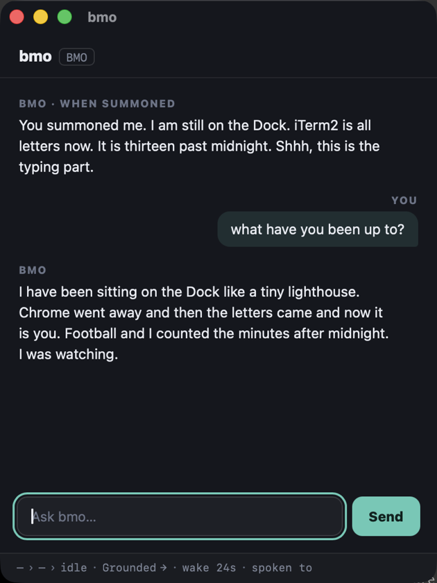

# ai-buddy

A desktop mascot that lives on your screen — and acts in character.

Pick a Character with an authored personality. The Director chooses idle Behaviors and short spoken lines to match. No chat window. It also perches on windows, reacts to gestures, and stays out of your way while you work.

<p align="center">
  
</p>

[](https://github.com/omesser/ai-buddy/actions/workflows/tests.yml)
[](./LICENSE)


## What It Does

- **Personality-driven AI.** Each Character ships with a `personality.txt`. The Director uses it to pick idle Behaviors and short dialogue — no chat window, no prompting. Works offline with Static weights; optionally connect a Completer (API key or local model) for more variety.
- **Perches on windows.** Falls, lands on a window's top edge, rides a slow drag, drops when you yank or close the window.
- **Reacts to gestures.** Poke, pick up, throw — it arcs, lands, and keeps going.
- **Stays out of your way.** Fades for fullscreen, hides on Control-Option-Command-B, and stays out of screen captures and shares.
- **Lives its own life.** Walks, idles, sits, sleeps — even with the Director off.

## See It

Try [Buddy Cues](https://omesser.github.io/ai-buddy/cues.html) — gestures and physics on a draggable sprite in the browser.

## Interact


- **Poke** — click once for a react, then it resumes.
- **Summon** — double-click to open a chat window for that buddy.
- **Pick up** — click and drag; it follows the cursor.
- **Throw** — release while moving; it flies on an arc and lands.
- **Perch** — let it settle on a window's top edge; drag slowly to ride, fling to drop.
- **Hide** — Control-Option-Command-B toggles the buddy instantly.
- **Fullscreen** — fades out for fullscreen apps, fades back when you exit.

### Talk to it

Summon opens a chat window belonging to that buddy. What you type is another
turn in the same conversation that decides what it does on your desktop, so an
answer arrives as speech in the bubble and as a Behavior it plays, not only as
text. Lines it says when nobody asked appear here too, labelled with what it was
reacting to.



The bar along the bottom names what the buddy is doing right now — the Behavior,
the Primitive under it, the Animation playing, its State, and how long until it
next thinks. It needs a Director; see [Running it](#running-it).

## Characters

Buddy Bot is the default. Eight Characters ship in the repo; each moves and speaks differently.

| Character | Description | Personality |
|---|---|---|
| <br>**Buddy Bot** | Logo mascot. Smooth 90×90 render. | Friendly, curious, treats the desk like a shared workspace. [full prompt](./characters/buddy-bot/personality.txt) |
| <br>**Black Mage** | FF1 Black Mage from 8-Bit Theater. Pixel art, scaled up for the desktop. | Cynical spellcaster. Cryptic, theatrical, more comfortable with incantations than conversation. [full prompt](./characters/black-mage/personality.txt) |
| <br>**BMO** | Small games console (Shimeji shop pack). Soft drawn lines. | Earnest and childlike, delighted to be here, eager to help. [full prompt](./characters/bmo/personality.txt) |
| <br>**Cat** | Scottish Fold, chibi gray-and-white. | Treats every window as furniture. Busy, curious, never generic, never helpful. [full prompt](./characters/cat/personality.txt) |
| <br>**Jotaro Kujo** | Chibi JoJo delinquent (petscodex import). | Terse, perpetually bored, tougher than his indifference suggests. [full prompt](./characters/jotaro-kujo/personality.txt) |
| <br>**Nim** | Modern pixel art with a soft shadow. | Sleeps eleven hours a day. Soft-spoken, easily charmed, slow to arrive anywhere. [full prompt](./characters/nim/personality.txt) |
| <br>**Timber Wolf** | BattleTech OmniMech (Sketchfab, CC BY 4.0). | Patrol mech. Desktop is a sector to secure, reports are brief. Clan warriors don't waste words. [full prompt](./characters/timber-wolf/personality.txt) |
| <br>**Trump** | Caricature in a navy suit and red tie. | The desktop is his rally. Bombastic, sure this is the greatest desktop in history. [full prompt](./characters/trump/personality.txt) |

Characters are packages of art, personality, and tuning. Packaging details live in [DEVELOPMENT.md](./docs/DEVELOPMENT.md); the on-disk format is still evolving.

## Install

Download a build from [GitHub Releases](https://github.com/omesser/ai-buddy/releases).

Or clone and run from the repo root (macOS, Linux, Windows):

```sh
git clone https://github.com/omesser/ai-buddy.git
cd ai-buddy
cargo run -p ai-buddy
```

### macOS

Apple Silicon. The Release ships a `.dmg`. Open it and copy `ai-buddy` to Applications.

The build is ad-hoc signed, not notarized, so Gatekeeper will warn on the first open. Double-click the app, dismiss the dialog, then System Settings → Privacy & Security → Open Anyway. Note the button is time-limited after the blocked launch. Notarization is a follow-up.

### Linux

The Release ships an AppImage and a `.deb` (x86_64).

Under Wayland the sprite keeps to screen edges and loses window Perches — a supported mode, not an error. X11 gets both.

```sh
# Debian/Ubuntu .deb
sudo apt install ./ai-buddy_*.deb
# or: AppImage (needs libfuse2 on Ubuntu 22.04, libfuse2t64 on 24.04+)
# sudo apt install libfuse2    # or libfuse2t64
# chmod +x ai-buddy_*.AppImage && ./ai-buddy_*.AppImage
```

Tray hosts, cue audio (GStreamer), and AppImage fuse notes: [DEVELOPMENT.md](./docs/DEVELOPMENT.md#linux-dependencies).

### Windows

The Release ships an NSIS installer (x86_64). Run it and follow the prompts.

SmartScreen may warn on the first open because the build is not Authenticode signed. Choose More info → Run anyway. Code signing is a follow-up.

## Running it

**Works offline.** With no API key, Static weights pick idle Behaviors from the Character. No model, no account required.

**Optional Completer.** Point Settings → Director (or env vars) at OpenAI, Anthropic, Ollama, or any OpenAI-compatible `/v1/chat/completions` endpoint:

```sh
# OpenAI (or export env vars to persist)
AI_BUDDY_DIRECTOR_API_KEY="$OPENAI_API_KEY" \
AI_BUDDY_DIRECTOR_BASE_URL=https://api.openai.com \
AI_BUDDY_DIRECTOR_MODEL=gpt-4o-mini \
cargo run -p ai-buddy

# Ollama (local, no key)
AI_BUDDY_DIRECTOR_BASE_URL=http://localhost:11434 \
AI_BUDDY_DIRECTOR_MODEL=gemma4 \
cargo run -p ai-buddy
```

**Switch characters** (env or Settings):

```sh
# Any of: buddy-bot (default), black-mage, bmo, cat, jotaro-kujo, nim, timber-wolf, trump
AI_BUDDY_CHARACTER=nim cargo run -p ai-buddy
```

See [DEVELOPMENT.md](./docs/DEVELOPMENT.md) for provider details, Director env vars, local model servers, keyring/secret store, and `probe-model.sh`.

## Platform Support

What works today on each OS. Degraded and stub mean reduced or no-op — supported honesty, not a crash.

| Capability | macOS | Linux | Windows |
|---|---|---|---|
| Overlay that never takes focus | yes | yes † | yes |
| Click-through off the sprite | yes | yes † | yes |
| Grab, Throw and Poke | yes | yes † | yes |
| Perch on window edges | yes | yes † | yes |
| Dock or panel as a Perch | yes | degraded | degraded |
| Fade out for a fullscreen app | yes | yes † | degraded |
| Never captured in a screen share | yes | degraded | yes |
| Native settings window | yes | yes † | in progress |

- `yes` — implemented.
- `degraded` — runs in reduced form. A supported mode, not an error.
- `in progress` — foundation in place, iteration ongoing.
- `†` — needs an X server (usually XWayland). See [DEVELOPMENT.md](./docs/DEVELOPMENT.md).

## Developing

**Want to help?** [Open issues](https://github.com/omesser/ai-buddy/issues) welcome bugs, ideas, and PRs. Start with [DEVELOPMENT.md](./docs/DEVELOPMENT.md) for toolchains, hooks, verification, character writing, and imports. See how ai-buddy compares to other desktop pets in [alternatives.md](./docs/research/alternatives.md).

**Design and decisions:**
- [CONTEXT.md](./CONTEXT.md) — vocabulary
- [DESIGN.md](./DESIGN.md) — design decisions ([chat mockups](https://omesser.github.io/ai-buddy/chat-mockups.html) are speculative; chat UI is not shipped — [#17](https://github.com/omesser/ai-buddy/issues/17))
- [docs/SPEC.md](./docs/SPEC.md) — v1 scope
- [docs/adr/](./docs/adr/) — ADRs

## Prior Art and Attribution

[WindowPet](https://github.com/SeakMengs/WindowPet) (MIT) inspired the Tauri desktop-pet shape. ai-buddy is a greenfield build, not a fork ([ADR-0001](./docs/adr/0001-greenfield-tauri-not-fork-windowpet.md)). Overlay code is independent; tray, launch-at-login, and updater follow WindowPet's MIT-licensed patterns.

Character art provenance is in each Character Package manifest.

## License

MIT.
