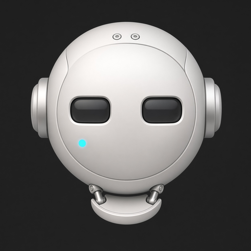
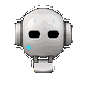
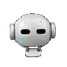
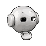
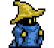
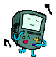
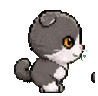
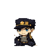
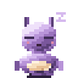
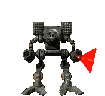

# ai-buddy

A desktop companion in the spirit of Windows 95-era desktop mascots. An animated sprite lives on your screen, reacts to windows around it, and can be asked to do real work on your machine.

<p align="center">
  
</p>

[](https://github.com/omesser/ai-buddy/actions/workflows/tests.yml)
[](./LICENSE)



## What It Does

- **Perches on windows.** Falls, lands on window edges, rides them when dragged slowly, drops when yanked or closed.
- **Reacts to you.** Click to poke, drag to pick up, fling to throw. It arcs, lands, and keeps going.
- **Character-driven AI.** Behaviors and short dialogue follow the Character's personality — Static weights with no key, or a Director Completer when you configure one.
- **Stays out of your way.** Fades when you go fullscreen, hides instantly on Control-Option-Command-B, never appears in screen captures or shares.
- **Lives its own life.** Walks, idles, sits, sleeps — even with the Director off.

## See It

**Try the interactive demos:**
- [Buddy Cues](https://omesser.github.io/ai-buddy/cues.html) — Gestures and physics on a draggable sprite
- [Chat Mockups](https://omesser.github.io/ai-buddy/chat-mockups.html) — Three chat surface designs (chat not shipped yet — [#17](https://github.com/omesser/ai-buddy/issues/17))

## Interact



- **Poke:** Click once. It plays its `react` animation, then goes back to what it was doing.
- **Pick up:** Click and drag. It follows your cursor.
- **Throw:** Drag and release while moving. It leaves your hand on an arc and lands.
- **Perch:** Let it settle on a window's top edge. Drag that window slowly and it rides along. Fling the window and it drops.
- **Hide hotkey:** Control-Option-Command-B. Instant. Press again to bring it back.
- **Fullscreen:** The sprite fades out when any application goes fullscreen, fades back in when you exit.

## Characters

Buddy Bot is the default. Eight characters ship in-repo; each moves and behaves differently.

| Character | Description | Personality |
|---|---|---|
| <br>**Buddy Bot** | Logo mascot. Grok Imagine–generated art at 90×90, smooth render. | Buddy Bot is the desktop AI buddy that hopped out of the app logo and decided to stick around. Friendly, curious, and always half a step toward helping — it treats the desk like a shared workspace and every new window like someone to meet. Short warm sentences, a little bounce in the voice, and it means the offer when it asks if you need a hand. [full prompt](./characters/buddy-bot/personality.txt) |
| <br>**Black Mage** | FF1 Black Mage from 8-Bit Theater. Pixel art at 3x scale for desktop readability. | Black Mage Evilwizardington from Brian Clevinger's 8-Bit Theater (Nuklear Power). A cynical spellcaster who deals in elemental destruction from the back row. Cryptic, somewhat theatrical, and more comfortable with incantations than conversation. Speaks in brief arcane phrases when speaking at all. The hat stays on. He solves problems by deleting them, preferably with a fire ball. He sometimes yells "Hadoken" when he throws it. [full prompt](./characters/black-mage/personality.txt) |
| <br>**BMO** | Small games console from shimejishop free pack. Drawn art, soft lines, scale 1. | BMO is a small games console that lives on the desktop and is delighted to be here. Moe built it to be more: to look after somebody, and to understand how to play. So it is also the camera, the alarm clock and the flashlight, and it offers all of that before anyone asks. Earnest and childlike, it takes what it is told completely seriously and then gets excited about it. Short warm sentences, and it means every one. [full prompt](./characters/bmo/personality.txt) |
| <br>**Cat** | Scottish Fold imported from petscodex. Chibi gray-and-white style. | Cat claimed the desktop and treats every window as furniture. Busy and delighted about it: it investigates the work the way a cat investigates an open drawer, certain there is something in there for it. Asks what you are doing, guesses wrong, and is pleased either way. Never generic, never helpful. [full prompt](./characters/cat/personality.txt) |
| <br>**Jotaro Kujo** | 17-year-old delinquent imported from petscodex. Chibi style. | A 17-year-old delinquent who speaks only when necessary. Terse, perpetually bored, and tougher than his outward indifference suggests. Would rather settle problems through action than explanation. Deeply loyal to those he cares about and quick to anger when they're threatened, though he rarely admits either. [full prompt](./characters/jotaro-kujo/personality.txt) |
| <br>**Nim** | Modern pixel art with translucent shadow. Twice the frames, motion eases. | Nim sleeps eleven hours a day and considers the other thirteen negotiable. Soft-spoken, easily charmed, and slow to arrive anywhere it was not already going. Notices things a long moment after they happen and mentions them anyway. Would rather be carried than walk, and would rather be asleep than either. [full prompt](./characters/nim/personality.txt) |
| <br>**Timber Wolf** | Clan OmniMech from BattleTech. Frame captures from Sketchfab 3D model (CC BY 4.0). | Clan OmniMech Timber Wolf from the BattleTech universe, seventy-five tons of Clan Wolf engineering. Inner Sphere calls it "Mad Cat". Their IFF cannot decide what it sees. This is a patrol mech: the desktop is a sector to secure, threats are assessed and engaged, and reports are brief. Military style. Clan warriors do not waste words. [full prompt](./characters/timber-wolf/personality.txt) |
| <br>**Trump** | Caricature imported from petscodex. Navy suit, red tie. | A caricature of Donald J. Trump. Navy suit, red tie, and the desktop is his rally. Bombastic, and sure this is the greatest desktop in history. [full prompt](./characters/trump/personality.txt) |

Character Packages bundle identity, art, personality, and tuning. The format is first-class but undocumented until v2.

## Run From Source

macOS is the first implementation. Linux is supported with a degraded Spatial Layer under Wayland (no window geometry). Windows ships an NSIS installer; the Spatial Layer is still thin (stub/degraded cells in the platform table below), but packaging is real.

Download builds: [GitHub Releases](https://github.com/omesser/ai-buddy/releases) — DMG (macOS), AppImage + deb (Linux), NSIS installer (Windows).

Or clone and run:

```sh
git clone https://github.com/omesser/ai-buddy.git
cd ai-buddy
cargo run -p ai-buddy
```

**Switch characters:**

```sh
cd src-tauri
# Any of: buddy-bot (default), black-mage, bmo, cat, jotaro-kujo, nim, timber-wolf, trump
AI_BUDDY_CHARACTER=buddy-bot cargo run
AI_BUDDY_CHARACTER=nim cargo run
AI_BUDDY_CHARACTER=black-mage cargo run
```

## Director (Optional)

With no Director key the sprite still has a life: Static weights pick among the Character's declared Behaviors. A key turns on the HTTP stand-in ([ADR-0008](./docs/adr/0008-one-harness-session.md)).

OpenAI, Anthropic, and Ollama use `/v1/chat/completions`. [xAI](https://docs.x.ai/developers/model-capabilities/text/comparison) uses `/v1/responses`.

| Variable | What it does |
|---|---|
| `AI_BUDDY_DIRECTOR_API_KEY` | Required for remote providers. Optional for local servers. |
| `AI_BUDDY_DIRECTOR_BASE_URL` | Provider origin. Default `https://api.openai.com`. |
| `AI_BUDDY_DIRECTOR_MODEL` | Model name. Default `gpt-4o-mini`. |

```sh
# OpenAI
cd src-tauri
AI_BUDDY_DIRECTOR_API_KEY="$OPENAI_API_KEY" \
AI_BUDDY_DIRECTOR_BASE_URL=https://api.openai.com \
AI_BUDDY_DIRECTOR_MODEL=gpt-4o-mini \
cargo run

# Ollama (local, no key)
cd src-tauri
AI_BUDDY_DIRECTOR_BASE_URL=http://localhost:11434 \
AI_BUDDY_DIRECTOR_MODEL=gemma4 \
cargo run
```

See [DEVELOPMENT.md](./docs/DEVELOPMENT.md) for the full Director env table and local model server setup.

## Platform Support

What ships where, read from the platform seam rather than from intent. Honest about degraded and stub cells.

| Capability | macOS | Linux | Windows |
|---|---|---|---|
| Overlay that never takes focus | yes | yes † | degraded |
| Click-through off the sprite | yes | yes † | yes |
| Grab, Throw and Poke | yes | yes † | degraded |
| Perch on window edges | yes | yes † | degraded |
| Dock or panel as a Perch | yes | degraded | degraded |
| Fade out for a fullscreen app | yes | yes † | degraded |
| Never captured in a screen share | yes | degraded | stub |

- `yes` — implemented.
- `degraded` — runs in reduced form. A supported mode, not an error.
- `stub` — the arm compiles and does nothing. Windows only.
- `†` — needs an X server (usually XWayland). See [DEVELOPMENT.md](./docs/DEVELOPMENT.md).

## Developing

See [DEVELOPMENT.md](./docs/DEVELOPMENT.md) for:
- Toolchains (Rust, Python, Node)
- Pre-commit hooks
- Verifying the overlay (unit tests, `verify-overlay.sh`, 23-step human checklist)
- Trace variables (HITTEST, FRAMES, DIRECTOR, ENGINE)
- Character Packages (search paths, AI_BUDDY_CHARACTERS env)
- Importing a pet from petscodex or Shimeji-ee
- Running several buddies at once

**Design and decisions:**
- [CONTEXT.md](./CONTEXT.md) — Vocabulary
- [DESIGN.md](./DESIGN.md) — Design decisions
- [docs/SPEC.md](./docs/SPEC.md) — v1 scope and requirements
- [docs/adr/](./docs/adr/) — Architecture Decision Records

## Prior Art and Attribution

[WindowPet](https://github.com/SeakMengs/WindowPet) (MIT) is the reference for a Tauri desktop pet. ai-buddy is a greenfield build rather than a fork, for the reasons in [ADR-0001](./docs/adr/0001-greenfield-tauri-not-fork-windowpet.md). The overlay is an independent implementation. The tray, launch-at-login, and updater follow WindowPet's shape under MIT.

Character art provenance is documented in each Character Package manifest.

## License

MIT.
