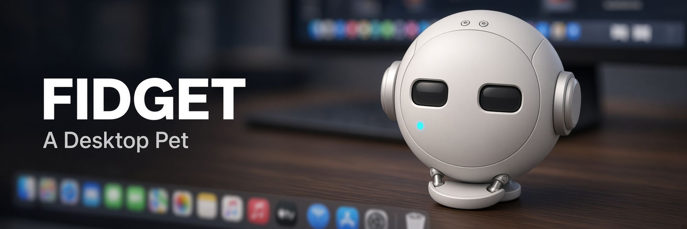
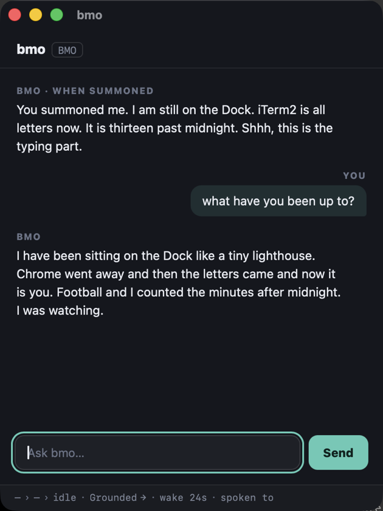
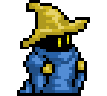
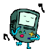
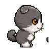
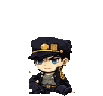
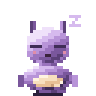
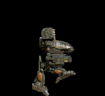
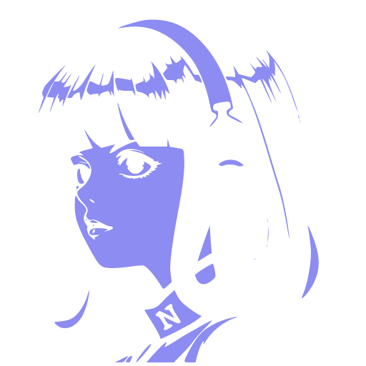

<div align="center">

<!-- Shields split on a single hyphen, so cursor-agent is cursor--agent in the URL. Each color is that harness's own hue, darkened until the white shield text stays readable. -->

[](https://github.com/omesser/fidget/actions/workflows/tests.yml) [](./LICENSE)

[](#harness-support) [](#harness-support) [](#harness-support) [](#harness-support) [](#harness-support) [](#harness-support) [](#harness-support) [](#harness-support) [](#harness-support) [](#harness-support)



</div>

# Fidget keeps you company while you vibe-code, and pitches in when you ask

An embodied AI that lives on your desktop. Pick it up, throw it around, let it nap, talk to it, or ask it to do anything that an AI harness can do (which is a lot)! It's a virtual manifestation of your favorite AI model and harness, with all of its capabilities.

Each character has a personality and a life of its own.


Try the gestures in your browser: [Fidget Cues](https://omesser.github.io/fidget/cues.html)

## What It Does

- **Keeps you company.** It walks, naps, and reacts to your open windows. It works offline, with no AI account or subscription, for presence and play; hook it up to an AI and it takes on a life of its own, with full conversation and tool use.
- **Pick a character, or bring your own.** Eight built-in characters, each with its own sprites, animation loops, and personality. Edit any character's prompt or behavior using a plain-text personality file and a simple [manifest format](./docs/DEVELOPMENT.md#character-packages). Create your own characters, or [import and convert](./docs/DEVELOPMENT.md#importing-pets) one from the [Pets Codex](https://petscodex.com/) and [Shimeji Shop](https://shimejishop.com/) galleries.
- **Pitches in.** Double-click to chat with the agent you already use (Claude Code, Codex, Cursor, or any ACP [harness](#harness-support)); it acts on your machine and answers in speech and motion.
- **Knows what you're up to.** It can see and react to your open windows, for context-aware chatter. It reads window names only, with your consent, but [never takes screenshots](#computer-use).
- **Stays out of your way when you ask it to.** Automatically fades away when in fullscreen, hides at will on hotkey, and comes back when you want it to.

## Get It

Download a build from [GitHub Releases](https://github.com/omesser/fidget/releases): a `.dmg` for macOS (Apple Silicon), an AppImage and a `.deb` for Linux (x86_64), or an NSIS installer for Windows (x86_64). The builds are not signed yet, so the first open warns. On macOS, double-click `Fidget.app`, dismiss the Gatekeeper dialog, then System Settings → Privacy & Security → Open Anyway. On Windows, choose More info → Run anyway in SmartScreen.

Or clone and run from the repo root (macOS, Linux, Windows):

```sh
git clone https://github.com/omesser/fidget.git fidget
cd fidget
cargo run -p fidget
```

It works offline with no key. With nothing configured, Static weights pick idle Behaviors from the Character.

Right-click the fidget, or click the tray icon, and choose Settings….

Settings → Character picks which character it wears. Buddy Bot is the default. The others are under [Characters](#characters).

Settings → AI chooses who answers. Under AI source, pick `Harness · claude` or another name from [Harness Support](#harness-support). The Harness signs in on its own. For a Model API, pick Model API in AI source, then set Base URL, Model, and API key under Model / API. Presets fill the Base URL for OpenAI, Anthropic, xAI, and Ollama. Type any other OpenAI-compatible endpoint into Base URL. Apply saves the choice.

Developers and CI can override Settings with optional environment variables:

```sh
# Optional. Overrides Settings → AI → AI source.
FIDGET_HARNESS=claude cargo run -p fidget

# Optional. Overrides Settings → Character.
# Any of: buddy-bot (default), black-mage, bmo, cat, jotaro-kujo, nim, timber-wolf, trump
FIDGET_CHARACTER=nim cargo run -p fidget
```

The full variable list, including `FIDGET_DIRECTOR_*`, is in [harness.md](./docs/harness.md#director-environment). Character packages are in [DEVELOPMENT.md](./docs/DEVELOPMENT.md#character-packages). Keychain dialogs an unsigned build costs are in [harness.md](./docs/harness.md#settings-and-keyring). Full support for window Perches and edges via X11/XWayland (the normal Linux desktop path). Pure Wayland sessions without an X server fall back to screen edges only. Linux packages and the AppImage's FUSE dependency are in [DEVELOPMENT.md](./docs/DEVELOPMENT.md#linux-dependencies).

## Interact


- **Poke** - click once for a react, then it resumes.
- **Summon** - double-click to open a chat window for that fidget.
- **Pick up** - click and drag; it follows the cursor.
- **Throw** - release while moving; it flies on an arc and lands.
- **Perch** - let it settle on a window's top edge; drag slowly to ride, fling to drop.
- **Hide** - Control-Option-Command-B (the default; change it in Settings) toggles the fidget instantly.
- **Fullscreen** - fades out for fullscreen apps, fades back when you exit.

### Talk to It

Summon opens that fidget's chat window. What you type joins the same
conversation that decides what it does on your desktop, so an answer arrives as
speech and a Behavior, not only as text. Lines it says unprompted appear here
too, labelled with what it was reacting to.



The bar at the bottom says what the fidget is doing and when it next thinks.
Advanced opens the ladder: Behavior, Primitive, Animation, State, Facing, and
the Director's countdown. Answers need a Director; see [Get It](#get-it).

## Characters

Buddy Bot is the default. Eight Characters ship; each moves and speaks differently. A name links to its full prompt.

<table>
<tr>
<td align="center" width="25%"><br><b><a href="./characters/buddy-bot/personality.txt">Buddy Bot</a></b><br><sub>Friendly and curious; he's your helpful assistant.</sub></td>
<td align="center" width="25%"><br><b><a href="./characters/black-mage/personality.txt">Black Mage</a></b><br><sub>Cynical spellcaster, cryptic and theatrical.</sub></td>
<td align="center" width="25%"><br><b><a href="./characters/bmo/personality.txt">BMO</a></b><br><sub>Earnest, childlike, delighted to be here.</sub></td>
<td align="center" width="25%"><br><b><a href="./characters/cat/personality.txt">Cat</a></b><br><sub>Every window is furniture. Never helpful.</sub></td>
</tr>
<tr>
<td align="center" width="25%"><br><b><a href="./characters/jotaro-kujo/personality.txt">Jotaro Kujo</a></b><br><sub>Terse, perpetually bored, tougher than he lets on.</sub></td>
<td align="center" width="25%"><br><b><a href="./characters/nim/personality.txt">Nim</a></b><br><sub>Sleeps eleven hours a day. Soft-spoken.</sub></td>
<td align="center" width="25%"><br><b><a href="./characters/timber-wolf/personality.txt">Timber Wolf</a></b><br><sub>Patrol mech. Clan warriors don't waste words.</sub></td>
<td align="center" width="25%"><br><b><a href="./characters/trump/personality.txt">Trump</a></b><br><sub>The desktop is his rally. Bombastic.</sub></td>
</tr>
</table>

Characters are packages of art, personality, and tuning. See [DEVELOPMENT.md](./docs/DEVELOPMENT.md#character-packages); the format is still evolving.

## Harness Support

Which Harness you attach changes what Fidget can do with it.

| Harness | Command | Standing |
|---|---|---|
|  `claude` | `npx -y @agentclientprotocol/claude-agent-acp@latest` | Zed's adapter over the Claude Agent SDK; no first-party ACP mode. Fresh and resumed sessions both work. |
| `codex` | `npx -y @agentclientprotocol/codex-acp@latest` | Zed's adapter (`codex-acp`); no first-party ACP mode. Fresh and resumed sessions both work. |
|  `copilot` | `copilot --acp` | First-party, GitHub. `copilot` alone is the interactive TUI. Fresh and resumed sessions both work, smoked on copilot 1.0.88 (#1016). |
|  `cursor-agent` | `cursor-agent acp` | First-party. `cursor-agent` alone is the interactive TUI. Every attach opens a fresh session, because it advertises no `loadSession`. |
| <picture><source media="(prefers-color-scheme: dark)" srcset="./docs/readme/grok-on-dark.svg" /></picture> `grok` | `grok agent stdio` | First-party, Grok Build. `grok` alone is the interactive TUI. Fresh and resumed sessions both work. |
| `goose` | `goose acp` | First-party, Block. `goose` alone is the interactive CLI. Fresh and resumed sessions both work, smoked on goose 1.51.0. |
|  `opencode` | `opencode acp` | First-party. Fresh and resumed sessions both work. |
|  `hermes` | `hermes acp` | First-party. Fresh sessions work; a resume that cannot restore the session reopens (#448). |
|  `pi` | `npx -y pi-acp@latest` | Zed-registry adapter (`pi-acp`); no first-party ACP. Fresh and resumed sessions both work. |
|  `antigravity` | `agy_acp_server.par` (`agy_acp_server.exe` on Windows) | First-party, Google's ACP server; `agy` itself has no ACP mode. Fresh and resumed sessions both work, smoked on agy_acp_server 1.2.1 (#604). |
| anything else | as typed, split on whitespace | Unnamed, and it works: any command that speaks ACP on stdio attaches. |

Tools each harness keeps under ACP, session and auth behavior, and per-harness setup notes are in [docs/harness.md](./docs/harness.md#harness-support).

### Harness ↔ MCP

Fidget attaches to a Harness over ACP on stdio. The Harness calls back over MCP, on the route the [MCP transport column](./docs/harness.md#harness-support) describes. [harness.md](./docs/harness.md#mcp-server) has the transport details.

**Seven tools** from `crates/core/src/dispatch.rs`. The opening turn of the Character Prompt tells the model to use the tools it has, without naming them, so this table stays the only catalog (#917):

| Tool | Category | What it does |
|---|---|---|
| `speak` | Expression | Make the Character speak dialogue |
| `play_behavior` | Expression | Play a named Behavior |
| `list_windows` | Sensing | List visible windows with bounds, and their names under consent |
| `describe_screen` | Sensing | Describe screen (v1: window metadata only) |
| `recall` | Memory | Read everything Memory holds |
| `remember` | Memory | Write one fact under a heading |
| `list_instances` | Identity | List Character Instances and their names |

**Three readonly resources** (`resources/list`, `resources/read`; no write, no subscribe):

| URI | What it is |
|---|---|
| `fidget://windows` | Visible windows, frontmost first, with the owning application and the title. Empty without the window-names consent, which covers both (ADR-0032). Same excluded applications as `list_windows`. |
| `fidget://memory` | The Memory Manifest file every Character Instance shares. |
| `fidget://action-log` | The current Action Log file only. Rotated siblings are not this resource. A large current file is tailed to complete JSONL lines. |

**Explicitly not served:** mouse/keyboard/Executor tools (ADR-0003). No click, no type, no input events by design.

### Computer Use

Fidget never reads screen pixels. Sensing is OS window metadata: bounds and idle for free, plus the owning application, the title and the frontmost app under one consent ([ADR-0032](./docs/adr/0032-one-consent-for-titles-and-application-names.md)). So `describe_screen` describes the window layout, not what is on screen. Decline it and the fidget still knows where the windows are, and not what they are. The fidget takes no screenshots, runs no OCR, and embeds no vision model for desktop content. The "Appear in screenshots and screen shares" setting is the other direction: whether the *sprite* shows up in captures you take.

That bounds Fidget's own code, not the agent you attach to it. An agent that needs to see and act on your desktop still can. The capability comes from the Harness itself, or from a computer-use MCP server you attach to the Harness, never through Fidget, whose MCP serves no input events.

The portable option across the Harnesses above is [cua-driver](https://github.com/trycua/cua) (MIT; macOS, Windows, Linux), attached over stdio MCP. [Connect your agent to Cua Driver](https://cua.ai/docs/how-to-guides/driver/connect-your-agent) carries the per-client registration, and [MCP tools](https://cua.ai/docs/reference/cua-driver/mcp-tools) lists what it exposes. Attach it deliberately: it drives the real desktop with your signed-in sessions, and its permission mode is chosen by the process that owns the driver runtime, not by the agent asking. Some Harnesses bring computer use of their own instead; the [Capture decision note](./docs/research/capture-drop-and-harness-cu-path.md) has the per-Harness table and the other drivers surveyed.

## Platform Support

What works today on each OS.

| Capability | macOS | Linux | Windows |
|---|---|---|---|
| Overlay that never takes focus | yes | yes | yes |
| Click-through off the sprite | yes | yes | yes |
| Grab, Throw and Poke | yes | yes | yes |
| Perch on window edges | yes | yes | yes |
| Dock or panel as a Perch | yes | degraded | degraded |
| Fade out for a fullscreen app | yes | yes | degraded |
| Capturable; opt-out in settings | yes | degraded | yes |
| Settings window | yes | yes | yes |

- `yes` - implemented.
- `degraded` - runs in reduced form. A supported mode, not an error.

Linux support is full on normal desktops (X11 or XWayland under GNOME/KDE). Rare pure Wayland sessions without an X server fall back to screen edges only - no window Perches, Grab, Throw, or fullscreen fade. See [DEVELOPMENT.md](./docs/DEVELOPMENT.md).

## Developing

**Want to help?** [Open issues](https://github.com/omesser/fidget/issues) welcome bugs, ideas, and PRs. Start with [DEVELOPMENT.md](./docs/DEVELOPMENT.md) for toolchains, hooks, verification, character writing, and imports. See how Fidget compares to other desktop pets in [alternatives.md](./docs/research/alternatives.md).

**Design and decisions:**

- [CONTEXT.md](./CONTEXT.md) - vocabulary
- [DESIGN.md](./DESIGN.md) - design decisions (the chat window ships; the [chat mockups](https://omesser.github.io/fidget/chat-mockups.html) are a Dated page, a frozen proposal, not what ships)
- [docs/SPEC.md](./docs/SPEC.md) - v1 scope
- [docs/adr/](./docs/adr/) - ADRs

## Prior Art and Attribution

Harness brand marks identify each Harness and belong to their owners. The Grok
logomark is xAI's own file from [their brand guidelines](https://x.ai/legal/brand-guidelines),
used unaltered to refer to Grok, which those guidelines permit and may revoke.
The Nous Research mark (`docs/readme/nous.svg`) identifies the Hermes Harness.
Every other mark is served from [Simple Icons](https://simpleicons.org) (CC0,
with each brand's trademark reserved to its owner).

[WindowPet](https://github.com/SeakMengs/WindowPet) (MIT) inspired the Tauri desktop-pet shape. Fidget is a greenfield build, not a fork ([ADR-0001](./docs/adr/0001-greenfield-tauri-not-fork-windowpet.md)). Overlay code is independent; tray, launch-at-login, and updater follow WindowPet's MIT-licensed patterns.

The Chat window's mind mark - the small brain beside what answers - is the
`brain` glyph from [Font Awesome Free](https://fontawesome.com/) 6.x, used
under [CC BY 4.0](https://creativecommons.org/licenses/by/4.0/) and inlined as
a path in `src/chat.html`. The license asks for the credit; this is it.

Character provenance is in each Character Package manifest, under `[source]`, and on the [Character Gallery](https://omesser.github.io/fidget/characters.html). In short: Buddy Bot and Nim are this project's own art. Timber Wolf derives, with the creator's permission, from [MekaRamen](https://mekaramen.com/)'s [Sketchfab model](https://sketchfab.com/3d-models/clans-timberwolf-battlemech-74e4d72e0cf3409ba3992cd0d895bc2f). BMO is cut from the [shimejishop BMO pack](https://shimejishop.com/free/bmo-shimeji/). Cat, Jotaro Kujo and Trump are cut from [petscodex](https://petscodex.com/) pets. Black Mage is sliced from GigaGuy's sprite sheet on The Spriters Resource. A package is prose, a manifest and art: the personality and the manifest - animations, Behaviors, Director and cursor tuning - are this project's work and MIT throughout. The art is not always ours. Some characters adapt art that declares no license, and each manifest names what it adapts and whose IP the character is.

## License

MIT.
