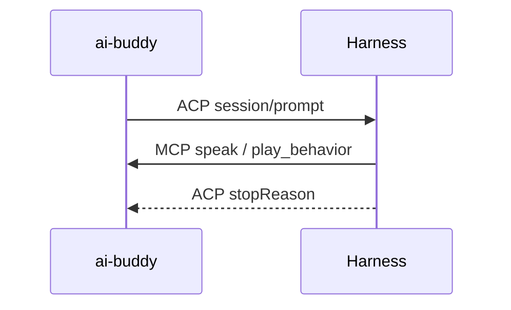

# Buddy–Harness two-way session

Research for #16 (and #166). Question: what protocol lets ai-buddy *initiate* a
turn in a user-supplied Harness — replacing the `Completer` seam in
`crates/core/src/director.rs` — while that same turn can still call ai-buddy's
MCP tools?

**Answer.** Use the **Agent Client Protocol** (ACP) for Buddy → Harness and keep
**MCP** for Harness → Buddy, in one ACP session. ai-buddy becomes the ACP
*client*: it spawns the harness, calls `session/new` once with its own MCP server
listed in `mcpServers`, and every Director wake or chat turn is a
`session/prompt` whose result arrives with a `stopReason` when the agent's whole
tool loop finishes. ACP is the only protocol that carries "inject a user turn
into a local agent that keeps its own tools, permissions, and memory," and all
five named harnesses reach it: Hermes, opencode and Grok Build first-party,
Claude Code and Pi via adapters. MCP cannot do this direction at all — as of
revision `2026-07-28` a server may not initiate anything, and Sampling is
deprecated with the migration advice "integrate directly with LLM provider APIs";
sampling was never an agent turn anyway, because the tool list comes from the
*server* and the message list is not retained between requests, which is the
split brain ADR-0008 forbids. Claude Code's `channels` feature does push events
into a live session from an MCP server, but it is a research preview behind an
Anthropic-maintained plugin allowlist and exists nowhere else, so it is a bonus
path, not the portable one. What is *not* portable: MCP sampling, channels, raw
TCP MCP, and A2A. For #166, the loopback answer is MCP **Streamable HTTP** on
`127.0.0.1` where the agent advertises `mcpCapabilities.http`, with the existing
`ai-buddy-mcp` stdio binary demoted to a thin shim that dials the running app —
which is exactly what OpenPets ships.

## What ACP is

[ACP](https://agentclientprotocol.com/) is JSON-RPC between a **client** (an
editor, or here ai-buddy) and an **agent** (the user's Harness). The client
starts a session and sends user turns with `session/prompt`. The agent thinks,
may call tools, and answers that prompt only when the turn is finished. Same
split as an IDE driving a coding agent. MCP is a different axis: how that agent
reaches tools. ai-buddy is the ACP client and, separately, the MCP server the
agent is handed at `session/new`.

A poke is the prompt. `speak` is a tool call *inside* that turn. Completer
`complete()` is waiting for `stopReason`.

## MCP as a reverse channel

The current protocol revision is **2026-07-28**: "The **current** protocol version
is [**2026-07-28**]".
<https://modelcontextprotocol.io/specification/versioning>

**There is no server-initiated direction.** The transport overview is explicit:
"A binding **MUST** deliver client-sent *requests* and *notifications* to the
server, and server-sent *responses* and *notifications* to the client. No other
message direction exists: per the message patterns, servers do not initiate
JSON-RPC requests and clients do not send JSON-RPC responses."
<https://modelcontextprotocol.io/specification/2026-07-28/basic/transports>

This is a deliberate break. Multi Round-Trip Requests (MRTR) replaced the old
pattern: "Servers **MUST** send server-to-client requests (such as `roots/list`,
`sampling/createMessage`, or `elicitation/create`) using the MRTR pattern. The
previous pattern of server-initiated requests is no longer supported. This is a
breaking change." A server asks for input by *returning* an
`InputRequiredResult` from a call the client already made, and the client retries
with `inputResponses`. Servers may only do this on `prompts/get`,
`resources/read`, and `tools/call`; "Servers **MUST NOT** send
`InputRequiredResult` responses on any other client requests."
<https://modelcontextprotocol.io/specification/2026-07-28/basic/patterns/mrtr>

Notifications are no help either. Request-scoped notifications ride the response
stream of the request they relate to; anything else requires the *client* to open
a `subscriptions/listen` stream and opt in to a fixed set of types
(`toolsListChanged`, `promptsListChanged`, `resourcesListChanged`,
`resourceSubscriptions`). The old HTTP GET endpoint is gone, as are protocol-level
sessions, `Mcp-Session-Id`, the `initialize` handshake, and `ping`.
<https://modelcontextprotocol.io/specification/2026-07-28/changelog>

So an ai-buddy MCP server cannot poke the harness. Everything it says is a reply
to something the harness asked for. #166's framing — ai-buddy is the server, the
harness is the client — is right, and it is precisely why #16 needs a second
protocol rather than a cleverer use of the first.

**The one first-party exception is Claude-Code-only.** "A channel is an MCP server
that pushes events into your running Claude Code session, so Claude can react to
things that happen while you're not at the terminal. Channels can be two-way:
Claude reads the event and replies back through the same channel."
<https://code.claude.com/docs/en/channels>
The contract is small: declare `capabilities.experimental['claude/channel']`
("Required. Always `{}`. Presence registers the notification listener."), emit
`notifications/claude/channel` with `content` and `meta`, connect over stdio; the
event reaches the model as a `<channel source="…">` tag, and a reply is an
ordinary MCP tool the server exposes.
<https://code.claude.com/docs/en/channels-reference>
That shape maps onto ai-buddy almost exactly: push "the user poked me", let
Claude answer through `speak`. The caveats are what disqualify it as the primary
path.

- Research preview: "the `--channels` flag syntax and protocol contract may change
  based on feedback", and neither flag appears in `claude --help`.
- Allowlisted: "During the preview, `--channels` only accepts plugins from an
  Anthropic-maintained allowlist, or from your organization's allowlist"; a
  channel you build needs `--dangerously-load-development-channels`.
- "They require Anthropic authentication through claude.ai or a Console API key,
  and are not available on Amazon Bedrock, Google Cloud's Agent Platform, or
  Microsoft Foundry." <https://code.claude.com/docs/en/channels>
- Version-locked to the pre-2026 handshake: on the v2 MCP runtime, Claude Code
  "Doesn't register a [channel] server that connects on the newer revision,
  because that revision can't carry channel messages."
  <https://code.claude.com/docs/en/mcp>
- Delivery is fire-and-forget: "Claude Code doesn't acknowledge notifications…
  If the session hasn't loaded your server as a channel, or the organization
  policy blocks it, Claude Code drops the events silently and returns no error to
  your server." A Director wake with no confirmable outcome is not a `Completer`.
- Claude Code spawns the channel server as a subprocess over stdio, so the
  process holding the buddy's state cannot *be* the channel server. It needs the
  shim described under Transports.

## MCP sampling vs an agent turn

Sampling is not a `Completer`, on two independent grounds.

**It is deprecated.** "**Deprecated**: The Sampling feature is deprecated as of
protocol version `2026-07-28` (SEP-2577). … New implementations **SHOULD NOT**
adopt it; existing implementations **SHOULD** migrate to integrating directly
with LLM provider APIs."
<https://modelcontextprotocol.io/specification/2026-07-28/client/sampling>
Roots and Logging went with it, and the `includeContext` values `"thisServer"`
and `"allServers"` "will be removed no later than the Sampling feature itself".
<https://modelcontextprotocol.io/specification/2026-07-28/changelog>

**Even where it works, it is not the agent's loop.** Sampling gained a tool loop,
but the *server* owns it: "Servers can request that the client's LLM use tools
during sampling by providing a `tools` array … The tool definitions in the
`tools` array are scoped to the sampling request — they don't need to correspond
to registered tools." After a `stopReason: "toolUse"` the server "Executes the
requested tool uses" and re-sends the whole message list. So ai-buddy would be
supplying the tools, running the loop, and paying for the orchestration — the
harness contributes a raw model call and nothing else. Its own tools, permission
prompts, project instructions, skills and memory are not in play. The
system prompt is advisory: "The client **MAY** modify or ignore this field."
And the conversation is explicitly not shared: "The list of messages in a
sampling request **SHOULD NOT** be retained between separate requests."
<https://modelcontextprotocol.io/specification/2026-07-28/client/sampling>

That last sentence is the direct collision with ADR-0008. Sampling gives you a
second mind that happens to bill through the harness's key — the "cheap
classifier plus Claude Code" the ADR rejects.

**Client support, first-party only.** VS Code implements it: "VS Code provides
access to sampling for MCP servers. This allows your MCP server to make language
model requests using the user's configured models and subscriptions… The first
time an MCP server performs a sampling request, the user is prompted to authorize
the server to access their models."
<https://code.visualstudio.com/api/extension-guides/ai/mcp>
Claude Code's MCP page documents elicitation in detail ("MCP servers can request
structured input from you mid-task using elicitation… No configuration is
required on your side") and never mentions sampling.
<https://code.claude.com/docs/en/mcp>
No first-party page for opencode, Hermes, Pi, or Grok Build claims sampling
support. Treat sampling as unavailable across the five harnesses.

## Agent Client Protocol

ACP is the editor↔agent session protocol, and it is shaped like the missing hop.
JSON-RPC 2.0, with the client driving: "Client → Agent: `initialize`… `session/new`
… `session/prompt` to send user message; Agent → Client: `session/update`
notifications for progress updates … Turn ends and the Agent sends the
`session/prompt` response with a stop reason."
<https://agentclientprotocol.com/protocol/v1/overview>

**A turn is a request/response with the whole tool loop inside it.** The agent
loops "Until completion", emitting `session/update` notifications for
`agent_message_chunk`, `tool_call`, `tool_call_update` and `plan`, asking
`session/request_permission` where needed, and only then: "If there are no
pending tool calls, the turn ends and the Agent **MUST** respond to the original
`session/prompt` request with a `StopReason`" — `end_turn`, `max_tokens`,
`max_turn_requests`, `refusal`, or `cancelled`. Cancellation is a
`session/cancel` notification and the agent "**MUST** respond to the original
`session/prompt` request with the `cancelled` stop reason".
<https://agentclientprotocol.com/protocol/v1/prompt-turn>
Note the text does not come back in the result: assistant text arrives as
`agent_message_chunk` notifications, so a `Completer` adapter accumulates chunks
and returns when the response lands. That is also the Action Log feed #16 wants —
tool calls, plans, and `usage_update` (`used`, `size`, optional `cost`) are all
on the same stream.

**The client supplies the MCP servers.** `session/new` takes `cwd` plus "A list
of MCP servers the Agent should connect to", and the spec states the intent
outright: "Clients **MAY** use this ability to provide tools directly to the
underlying language model by including their own MCP server." Transport support:
"All Agents **MUST** support connecting to MCP servers via stdio… When the Agent
supports `mcpCapabilities.http`, Clients can specify MCP servers configurations
using the HTTP transport", and "new Agents **SHOULD** support the HTTP transport
to ensure compatibility with modern MCP servers."
<https://agentclientprotocol.com/protocol/v1/session-setup>
This is the whole two-way story in one call: ai-buddy hands the harness its own
tool surface at session creation, then drives turns into it.

**Session continuity across restarts** is capability-gated: `session/load`
replays the entire conversation as `session/update` notifications before
responding, while `session/resume` "**MUST NOT** replay the conversation history
… Instead, it restores the session context, reconnects to the requested MCP
servers, and returns once the session is ready to continue." Both take the same
`mcpServers` list again. `session/close` cancels work and frees resources.
<https://agentclientprotocol.com/protocol/v1/session-setup>

**Transport is stdio today.** "The client launches the agent as a subprocess…
Messages are delimited by newlines (`\n`)… The agent **MAY** write UTF-8 strings
to its standard error for logging purposes." Streamable HTTP is listed as
"*(draft proposal in progress)*".
<https://agentclientprotocol.com/protocol/v1/transports>
The RFD proposes a single `/acp` endpoint with long-lived GET/SSE streams plus a
WebSocket upgrade, motivated by "ACP only has stdio. There is no standard remote
transport, which causes fragmentation".
<https://agentclientprotocol.com/rfds/streamable-http-websocket-transport>

**Rust, which matters for a Tauri app.** The `agent-client-protocol` crate
"provides implementations of both sides of the Agent Client Protocol"; ai-buddy
implements the `Client` trait. It "powers the integration with external agents in
the Zed editor."
<https://agentclientprotocol.com/libraries/rust>

**A v2 is in draft** and changes the turn shape: `session/prompt` responds "once
the prompt is accepted", and the agent later sends "An idle `state_update` when
ready for a new prompt, with a stop reason when foreground work ends". Build the
adapter against v1 and keep the completion signal behind one function.
<https://agentclientprotocol.com/protocol/v2/overview>

**Client-side prior art in the same shape as ai-buddy**: Jockey, an "open-source
multi-agent orchestrator (Tauri + Rust + SolidJS) that coordinates Claude Code,
Gemini CLI, and Codex CLI via ACP", and Zed itself.
<https://agentclientprotocol.com/get-started/clients>

## Per-harness headless/session APIs

Every one of the five appears on ACP's own agent list, which is the cheapest way
to see coverage in one place: Claude Agent "via Zed's SDK adapter", Codex CLI,
Cursor, Gemini CLI, GitHub Copilot, Goose, "Hermes Agent", "OpenCode", "Pi …
via pi-acp adapter", Qwen Code, and more.
<https://agentclientprotocol.com/get-started/agents>
Per-harness first-party detail below; where only a third-party adapter exists,
that is stated.

### Claude Code

**Inject a turn:** yes, through the Agent SDK. Python's `ClaudeSDKClient`
"handles session IDs internally. Each call to `client.query()` automatically
continues the same session"; TypeScript passes `continue: true` per call, or
`resume` with a captured session ID — "Required when you have multiple sessions…
or want to return to one that isn't the most recent." `fork` branches. Sessions
persist to disk automatically.
<https://code.claude.com/docs/en/agent-sdk/sessions>
Streaming input mode gives "a persistent session" with "Queued messages: send
multiple messages that process sequentially, with ability to interrupt" and
"Natural multi-turn conversations".
<https://code.claude.com/docs/en/agent-sdk/streaming-vs-single-mode>

**Reach ai-buddy's MCP tools in that turn:** yes. `mcpServers` accepts stdio
("Local processes that communicate via stdin/stdout"), `type: "http"` /
`"sse"` with a URL and headers, and in-process SDK servers.
<https://code.claude.com/docs/en/agent-sdk/mcp>

**ACP:** available, but the adapter is Zed's, not Anthropic's:
`@agentclientprotocol/claude-agent-acp`, "This tool implements an ACP agent by
using the official Claude Agent SDK", listing "Client MCP servers" among
supported features.
<https://github.com/zed-industries/claude-agent-acp>

**Caveat for the SDK path:** the SDK is a Node/Python library, so a Rust Tauri
app would drive it through a sidecar process and its own JSON protocol — which is
the shape DESIGN.md decision 17 rejected. ACP is the same subprocess with a
specified protocol instead of an invented one.

### opencode

**Inject a turn:** yes, and it needs no ACP at all. "The `opencode serve` command
runs a headless HTTP server that exposes an OpenAPI endpoint"; `POST
/session/:id/message` is documented as "Send a message and wait for response",
with `POST /session/:id/prompt_async` for "Send a message asynchronously (no
wait)", `POST /session/:id/abort`, `GET /session/:id/message`, and `GET /event`
as a "Server-sent events stream". Sessions are first-class: `POST /session`,
`GET /session`, `/fork`, `/revert`. The OpenAPI 3.1 spec is served at
`/doc` and the SDK is generated from it. Auth is `OPENCODE_SERVER_PASSWORD` over
HTTP basic; default bind is `127.0.0.1:4096`.
<https://opencode.ai/docs/server/>
It also exposes `GET /mcp` for status and `POST /mcp` to "Add MCP server
dynamically".

**ACP:** first-party. "OpenCode supports the Agent Client Protocol or (ACP)…
configure your editor to run the `opencode acp` command. The command starts
OpenCode as an ACP-compatible subprocess that communicates with your editor over
JSON-RPC via stdio", and "OpenCode works the same via ACP as it does in the
terminal. All features are supported", including "MCP servers configured in your
OpenCode config".
<https://opencode.ai/docs/acp/>

### Hermes

**ACP is first-party and is the programmatic entry.** "Hermes Agent can run as an
ACP server, letting ACP-compatible hosts talk to Hermes over stdio… Other hosts
can use the same protocol to route collaboration events into Hermes. ACP is a
good fit when you want Hermes to keep its existing identity, provider setup,
memory, skills, and tools while another application owns the conversation
transport." Launch with `hermes acp`, `hermes-acp`, or `python -m acp_adapter`
after `uv pip install -e '.[acp]'`; "Hermes logs to stderr so stdout remains
reserved for ACP JSON-RPC traffic."
<https://hermes-agent.nousresearch.com/docs/user-guide/features/acp>

**Client-supplied MCP servers are explicitly honoured**, and there is even a knob
for hosts that own MCP themselves: `HERMES_ACP_SKIP_CONFIGURED_MCP=1` skips
starting `config.yaml`'s servers, and "Only the global `config.yaml` discovery is
skipped. MCP servers supplied by the ACP session through `session/new` are still
registered, so a host loses no capability it asked for." That page is written for
exactly ai-buddy's case — a non-editor host owning the conversation.

One warning worth carrying into #16: Hermes' ACP toolset includes `terminal` and
`execute_code`, and Nous documents a host (Buzz) that auto-answers permission
requests, producing unattended shell execution. ai-buddy must forward
`session/request_permission` rather than answer it, which is also what DESIGN.md
decision 11 requires.

### Pi

**No MCP, by design.** The coding-agent README states it flatly: "**No MCP.**
Build CLI tools with READMEs (see Skills), or build an extension that adds MCP
support."
<https://github.com/badlogic/pi-mono/tree/main/packages/coding-agent>

**Inject a turn: yes, and it is the best-specified of the five.** "Pi runs in four
modes: interactive, print or JSON, RPC for process integration, and an SDK for
embedding in your own apps." RPC mode is `pi --mode rpc`, "a JSON protocol over
stdin/stdout… useful for embedding the agent in other applications, IDEs, or
custom UIs", with "strict JSONL semantics with LF (`\n`) as the only record
delimiter". The command is literally a prompt injection:
`{"id": "req-1", "type": "prompt", "message": "Hello, world!"}`, and mid-turn
injection is a first-class option — `streamingBehavior: "steer"` is "delivered
after the current assistant turn finishes executing its tool calls, before the
next LLM call", `"followUp"` waits until the agent stops.
<https://github.com/badlogic/pi-mono/blob/main/packages/coding-agent/docs/rpc.md>
Note the response semantics: `success: true` "means the prompt was accepted,
queued, or handled immediately", so turn completion is read off the event stream,
not the command response.

**ACP:** only via a third-party adapter, `pi-acp`, listed on ACP's agents page as
"(via [pi-acp adapter](https://github.com/svkozak/pi-acp))" — not published by
the Pi maintainers.
<https://agentclientprotocol.com/get-started/agents>

**Consequence for ai-buddy:** Pi is the harness that needs a bespoke adapter
either way. Buddy → Pi is `--mode rpc`. Pi → Buddy cannot be MCP; it has to be a
Pi extension exposing the buddy tools, which is the route OpenPets took
(`packages/pi` — "@open-pets/pi (Pi CLI extension integration)").
<https://github.com/alvinunreal/openpets>

### Grok Build

First-party, and it names both halves. xAI's announcement: "Headless mode (`-p`)
allows easily running agents inside scripts and automations. Grok Build also
provides full ACP support to build your own bots and agent orchestration apps."
It also states "Your AGENTS.md, plugins, hooks, skills, and MCP servers all work
out of the box."
<https://x.ai/news/grok-build-cli>

MCP transports are stdio and HTTP: "`grok mcp add <name> -- <command>`" for a
"Local stdio server", "`grok mcp add --transport http linear
https://mcp.linear.app/mcp`" for remote, with `${VAR}` expansion in `url`,
`command`, `args`, `env`, and `headers`, and `grok mcp doctor` for diagnosis.
Grok also reads `~/.claude.json`, `.cursor/mcp.json`, and project `.mcp.json`.
<https://docs.x.ai/build/features/mcp-servers>

**There is no first-party xAI page describing a TCP MCP transport.** `docs.x.ai`
documents stdio and `--transport http` only; `https://docs.x.ai/build/features/acp`
returns 404, so the ACP claim rests on the announcement page above. #166's "Grok
harness over TCP MCP" is an ai-buddy plan, not a documented Grok feature — and it
does not need to be one, because loopback Streamable HTTP is already supported.

## Transports (stdio vs Streamable HTTP vs TCP)

MCP defines two bindings: "stdio: newline-delimited messages over the standard
streams of a client-launched subprocess" and "Streamable HTTP: each message is an
HTTP POST to a single MCP endpoint; replies arrive as a JSON object or a
request-scoped SSE stream." Custom transports are permitted, and the spec
pre-answers #166: "Custom transports that run over a reliable bidirectional byte
stream (e.g., Unix domain sockets or TCP) **SHOULD** reuse the stdio framing…
the stdio binding is just newline-delimited JSON-RPC over a byte stream, and only
its process-lifecycle rules are specific to standard streams."
<https://modelcontextprotocol.io/specification/2026-07-28/basic/transports>

That permission is real but nearly useless in practice: a custom TCP binding is
only reachable by a client that implements it, and none of the five harnesses
does. Their config schemas offer `command`/`args` or a URL. So there are exactly
two ways for a long-lived app to serve MCP:

1. **Streamable HTTP bound to `127.0.0.1`.** Works with Claude Code
   (`type: "http"`), Grok (`--transport http`), opencode, and any ACP agent
   advertising `mcpCapabilities.http`. No child process, no invented framing,
   no lifetime inversion. This is the answer to #166.
2. **A stdio shim that dials the app.** The published binary stays `ai-buddy-mcp`
   with `rmcp::transport::stdio()`, but it holds no state: it forwards to the
   running Tauri app over a Unix socket, named pipe, or loopback TCP. Being a
   child of one agent session is then harmless, because the child is disposable.

**OpenPets is the shipped precedent for (2), for the same product.** Its
architecture doc names the split: the desktop app owns "a **local IPC server**…
This is the only long-lived process", while agent-side integrations are
"short-lived code that runs inside… (the Claude hook, the MCP server, the
OpenCode plugin, Cursor config, Pi extension…). They translate agent activity into
pet commands and send them over local IPC".
<https://github.com/alvinunreal/openpets/blob/main/docs/architecture.md>
The packaging matches: `@open-pets/mcp` is a "Stdio MCP server exposing
`openpets_status` / `react` / `say` to MCP agents", configured as
`{"type": "stdio", "command": "npx", "args": ["-y", "@open-pets/mcp@latest"]}`,
and it "talks to the local OpenPets desktop app through the same local IPC client
used by other integrations".
<https://github.com/alvinunreal/openpets>
Their IPC client validates "Unix sockets, Windows named pipes, TCP (IPv4)" with
"Line-delimited JSON protocol (`\n` separator)" — the same framing MCP's spec
recommends for byte-stream transports.
<https://github.com/alvinunreal/openpets/blob/main/packages/client/codemap.md>
Two details worth copying: security is "a local socket/named pipe, secured with a
per-run random security token" plus a discovery file the client reads, and
loopback TCP was added only as an opt-in for the one case that needs it — WSL
clients reaching a Windows app — after the default `127.0.0.1` bind proved
unreachable across WSL2 NAT.
<https://github.com/alvinunreal/openpets/issues/3>

For ACP itself, stdio is the only stable transport, and the direction is the one
ai-buddy wants: the client launches the agent. #166 objects that "a long-lived
companion must not be a child of one agent session" — ACP resolves that by
inverting it. The buddy is the parent.

## Google A2A

Not applicable. A2A "is designed to standardize communication between AI agents,
particularly those deployed in external systems", targeting agents "built on
different frameworks, and owned by different organizations", with "Opaque
Execution: Agents collaborate effectively without exposing their internal state,
memory, or tools", discovered via an Agent Card at
`/.well-known/agent-card` over HTTP. It is "positioned to complement MCP".
<https://a2a-protocol.org/latest/topics/what-is-a2a/>
Three mismatches: opaque execution is the opposite of what the Action Log needs,
the unit of collaboration is a remote peer rather than a local process the user
already installed, and no first-party page for any of the five harnesses
advertises an A2A server endpoint. Don't stretch it.

## Recommendation

1. **Implement ai-buddy as an ACP client in Rust.** Add
   `agent-client-protocol` and implement the `Client` trait. `initialize`,
   then one `session/new` per app lifetime; hold the `sessionId`.
2. **Fill the `Completer` seam with one `session/prompt` per wake.** The adapter
   sends the Character Prompt, accumulates `agent_message_chunk` content, and
   returns when the `session/prompt` response arrives; `stopReason != "end_turn"`
   maps to `Wake::Failed` so Static Director takes over, per ADR-0008. Reactive
   and backed-off proactive wakes are the same call with different triggers.
3. **Hand the harness ai-buddy's tools in `session/new`.** Prefer
   `{"type": "http", "name": "ai-buddy", "url": "http://127.0.0.1:<port>/mcp"}`
   when `initialize` reports `mcpCapabilities.http`; fall back to the stdio shim
   otherwise, since stdio support is mandatory for every agent. This is the
   sentence to build against: "Clients **MAY** use this ability to provide tools
   directly to the underlying language model by including their own MCP server."
4. **Serve MCP from the app over Streamable HTTP on loopback, and reduce
   `ai-buddy-mcp` to a shim** that dials the app over a Unix socket / named pipe
   / loopback TCP, gated by a per-run token in a discovery file, OpenPets-style.
   This closes #166 without inventing a TCP MCP binding, and keeps the
   copy-pasteable per-harness snippets #166 asks for down to a URL or one command.
5. **Ship the first-party adapter as ACP, and pick Hermes or opencode for the
   out-of-box path**, not Claude Code: `hermes acp` and `opencode acp` are
   first-party single commands, whereas Claude Code needs Zed's adapter. Grok
   Build is first-party ACP per x.ai but has no ACP docs page yet.
6. **Route the Action Log off the ACP update stream** — `tool_call`,
   `tool_call_update`, `plan`, `usage_update`, `stopReason` — rather than parsing
   a transcript. Forward `session/request_permission` to the harness's own
   surface; never answer it automatically (decision 11, and the Hermes/Buzz
   warning above).
7. **Pi gets a second adapter, not a compromise.** Buddy → Pi is
   `pi --mode rpc` with `{"type":"prompt",...}` and `streamingBehavior`; Pi →
   Buddy is a Pi extension wrapping the same tool set, because Pi has no MCP.
   Do not adopt the third-party `pi-acp` as the shipped path.
8. **Treat Claude Code `channels` as an optional enhancement behind a flag**, if
   ambient wake latency ever justifies it. It is the only way to push into a
   session the user started themselves, and it is a research preview behind an
   Anthropic allowlist that also pins the MCP revision. It cannot be the
   `Completer`, because notifications are unacknowledged.

## Non-goals / rejected

- **MCP sampling as the `Completer`.** Deprecated in `2026-07-28` with the
  migration path "integrate directly with LLM provider APIs", and structurally
  wrong regardless: the server supplies the tools, the server runs the loop, and
  "The list of messages in a sampling request **SHOULD NOT** be retained between
  separate requests." That is ADR-0008's split brain with extra steps.
- **MCP as the Buddy → Harness direction, in any form.** "No other message
  direction exists." An ai-buddy tool call cannot start a turn.
- **A custom TCP MCP transport as the #166 answer.** Allowed by the spec, dialled
  by no harness. Loopback Streamable HTTP plus a stdio shim covers all five.
- **Spawning the Claude Agent SDK behind a private JSON protocol.** Same
  subprocess cost as ACP with none of the specification; DESIGN.md decision 17
  already rejected the stdout-scraping version of this.
- **A2A.** Cross-organisation, opaque-execution, Agent-Card-discovered remote
  peers. Wrong unit, wrong visibility, and unimplemented by the five harnesses.
- **MCP elicitation as a chat surface.** It is client-input-to-server inside a
  tool call (Claude Code renders form and URL modes), not a way for ai-buddy to
  ask the model anything.

## Open, not resolved here

- Whether `mcpCapabilities.http` is advertised by each of the five in practice.
  The spec says agents "**SHOULD**" support HTTP, not must; verify per harness at
  `initialize` and keep the stdio shim as the fallback rather than a legacy path.
- Whether one ACP session should span app restarts via `session/resume`, or a
  fresh `session/new` per launch is better for a companion whose memory already
  lives in the Memory file. `session/resume` is capability-gated
  (`sessionCapabilities.resume`) and not universal.
- ACP v2's changed completion signal (accepted-then-idle `state_update`) will
  move where "the turn finished" is read. Keep that behind one function.
