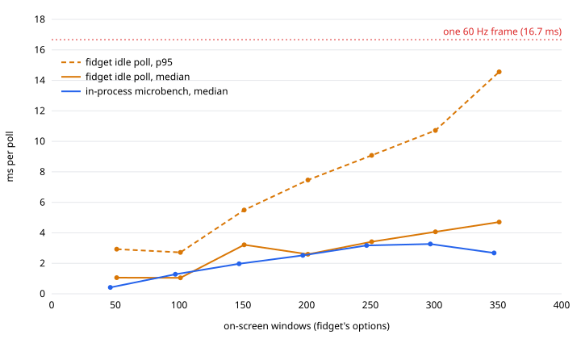

# Performance Baseline v1

Measured baselines for fidget performance before optimization work. See parent issue [#423](https://github.com/omesser/fidget/issues/423) for context and child benchmarks.

## Linux (issue #432)

**Environment:**
- Ubuntu 24.04.4 LTS (Noble)
- Kernel 6.12.94+ (cloud VM, not bare metal laptop)
- X11 via Xtigervnc (no Wayland)
- No desktop environment (headless VM)
- 4 vCPU Intel Xeon (virtualized)

**Measurement limitations:**
- VM has no real CPU C-states (no laptop power management)
- `powertop` system-wide wakeup measurement unavailable in VM
- No multi-monitor testing (single VNC display)
- Limited GUI interaction testing (headless environment)
- `perf` unavailable for kernel version
- Used context switches from `/proc/<pid>/status` as wakeup proxy

**Tools used:**
- `powertop 2.15` (limited data in VM)
- `/proc/<pid>/status` for context switch counting
- `htop`/`top` for CPU%
- Direct process measurement (60s samples)

**Metrics:**

| Scenario | Wakeups/sec (voluntary ctx switches) | CPU% | Notes |
|----------|--------------------------------------|------|-------|
| Baseline (no fidget) | 3.6 | - | X server (Xtigervnc) idle |
| Idle perched | ~271 | ~3% | Sprite visible, no interaction |
| Walking | N/A | N/A | Wakeups not measured; mask rebuild while walking measured on Grok Bot desktop (see #428 doc) |
| Chat open | N/A | N/A | Not measured (requires GUI interaction) |
| Multi-monitor | N/A | N/A | Not available in VM |
| Hidden | N/A | N/A | Not measured |

**Calculation details:**

Idle perched (60s sample, PID 12927):
- Initial voluntary context switches: 3,556
- After 60s: 19,821
- Rate: (19,821 - 3,556) / 60 = **271 voluntary ctx switches/sec**
- Average CPU: ~3%

Baseline X server (60s sample, PID 1594):
- Initial: 82,558
- After 60s: 82,772
- Rate: (82,772 - 82,558) / 60 = **3.6 ctx switches/sec**

**Findings:**

1. **High idle wakeup rate.** fidget idle shows ~271 wakeups/sec vs baseline 3.6/sec (75x increase). Hypothesis: unconditional frame loop sleep (~16ms = ~60Hz) plus additional subsystem polling.

2. **VM measurement constraints.** C-state residency and system-wide wakeup counting unavailable. Context switches are a coarse proxy. Bare-metal measurements would provide more accurate power impact data.

3. **Comparison to macOS target.** macOS issue [#431](https://github.com/omesser/fidget/issues/431) targets ~60 wakeups/sec idle. Linux VM shows 4.5x higher rate. Unknown how much is VM overhead vs real difference.

4. **Untested scenarios.** Walking, chat open, and window state changes require GUI automation not feasible in headless VM. Multi-monitor testing requires different environment.

**Evidence:**

Startup log excerpt:
```
character: BMO from target/debug/characters/bmo
libEGL warning: DRI3 error: Could not get DRI3 device
window_source: 0 visible windows
overlay: overlay-0 covers 1920x1200 at (0,0)
overlay: 1 display(s); sprite 126x128; BMO as BMO
director: StaticDirector
```

`powertop` output shows minimal data in VM (see issue comment for full CSV).

**Status:** Partial baseline captured. Idle perched wakeup rate measured. Full scenario matrix blocked by VM/headless constraints. Bare-metal Linux desktop testing recommended for complete baseline.

_Measured in cloud agent environment. Real laptop measurements would capture C-state residency and battery impact._

## macOS (issue #431)

_Pending._

## GPU Compositing

### macOS Metal (issue #429)

Re-run with `sudo -v && FIDGET_BENCH_GREEN_LIGHT=1 scripts/bench-gpu-compositing-macos.sh matrix --seconds 15`. The script refuses every scenario but `env` and `baseline` without that variable, because the rest launch fidget on the live desktop, warp the cursor, or cover the main display. Written against `79cd3061`.

**Tools:**

- `scripts/bench-gpu-compositing-macos.sh`
- GPU% is `ioreg -c IOAccelerator` `PerformanceStatistics` `Device Utilization %`, sampled once a second, no sudo. VRAM is `In use system memory` from the same dictionary, which on Apple silicon is the GPU's share of unified memory.
- Watts and HW active residency are `sudo powermetrics --samplers gpu_power`, reduced by `scripts/parse-powermetrics.py`.
- Frame rate is N/A. The compositor's presented rate needs Instruments (Metal System Trace). `ticks_hz` counts the engine's `frame:` lines instead, so it says how often the rAF loop ticked, not how often WindowServer composited.
- Chat and hidden reuse `scripts/click-cursor.swift` and `scripts/fullscreen-window.swift` from `scripts/bench-wakeups-macos.sh`.

**Environment:**

- Mac15,7 (Apple M3 Pro, `AGXAcceleratorG15X`), macOS 26.7 (25G229)
- Two displays, 60 Hz
- `target/debug/fidget`, one 15 s window per scenario

**Metrics:**

| Scenario | GPU% (ioreg) | GPU active% (powermetrics) | Power W | VRAM MB | ticks/s | Notes |
|----------|--------------|----------------------------|---------|---------|---------|-------|
| Baseline (no fidget) | 0.3 | 5.50 | 0.06 | 565 | N/A | No fidget running |
| Idle perched | 0.6 | 6.13 | 0.06 | 708 | 52.73 | Pointer left alone, 791 ticks |
| Walking | 0.8 | 7.33 | 0.04 | 672 | 52.40 | 209 walk frames during the sample |
| Chat open | 0.3 | 5.68 | 0.03 | 678 | 53.00 | Summon logged at 960 923 |
| Multi-monitor | 0.5 | 4.92 | 0.03 | 636 | 52.87 | Two displays, two overlays |
| Hidden (fullscreen) | 0.0 | 4.80 | 0.03 | 540 | 1.07 | `presence: hidden`, 16 ticks |

**What this refutes.**

The issue predicted idle perched would hold 5-15% GPU and cost 0.5 to 2 W. It holds 0.6% and 0.06 W, the same wattage as an idle desktop with no fidget on it. Fullscreen transparent compositing is not a measurable GPU cost on this machine.

It also predicted multi-monitor would roughly double, two overlays being two compositing passes. Two displays measured 0.5% against one display's 0.6%. There is no doubling to find.

Walking against idle was predicted to be similar, and is: 0.8% against 0.6%.

**The noise floor is the result.** Every fidget scenario falls between 0.3% and 0.8%. A 10 s baseline taken minutes earlier on the same idle desktop read 1.2%, above every one of them. The overlay's GPU compositing cost is smaller than this instrument's run-to-run spread, so these deltas rank nothing. Anyone optimizing against them is fitting noise.

**What the hide rule actually saves.** GPU% does drop to 0.0 when a fullscreen app hides the sprite, which is what the issue asked to confirm. But the saving that shows up clearly is on the other axis: engine ticks collapse from roughly 53/s to 1.07/s. The hide rule earns its keep by stopping the rAF loop, not by sparing the compositor. That points the remaining #423 work at CPU wakeups (#431), not at compositing.

**Limits.** One machine, Apple silicon, unified memory, and a debug build. An Intel Mac with a discrete GPU composites transparency differently and the issue's Intel Power Gadget route is unrun. `ticks_hz` is the engine's own loop, not presented frames; the compositor's real rate still needs Instruments.

### Windows DWM (issue #430)

Re-run on the workstation in [mask-rebuild-baseline-windows.md](./mask-rebuild-baseline-windows.md):

`powershell -NoProfile -File scripts\bench-gpu-compositing-windows.ps1 matrix --seconds 15`

The script waits for an explicit green light before it launches fidget or moves the cursor.

A Linux cloud VM has no DWM, so it cannot measure GPU%, power, xperf frame time, or mask rate. The Windows desktop numbers are below.

Crop Task Manager's Performance GPU page during idle perched to about 280px wide and attach it with `gh pr comment --attach` in `file#alt` form. The script does not write the image. The image does not belong in the tree.

**Tools**

- `scripts/bench-gpu-compositing-windows.ps1`
- GPU% on Windows is `\GPU Engine(*)\Utilization Percentage` summed for `dwm.exe` `engtype_3D`, then WMI `Win32_PerfFormattedData_GPUPerformanceCounters_GPUEngine`, then `nvidia-smi` for the whole adapter.
- Power is `nvidia-smi` `power.draw` when that field is numeric. Those watts are the adapter.
- `mask_rebuild:` lines are `SetWindowRgn` calls. Per-call time stays in [#428](https://github.com/omesser/fidget/issues/428).
- `parse-log --seconds 2` on a 4-line fixture printed `mask_calls=4` and `mask_hz=2.00`. That fixture is not a Windows trace.
- Walking-over aims at the last `walk` or `ballwalk` frame. The cursor coordinate is that point times the primary's physical width over the overlay width in the log. `GetCursorPos` has to match.

**Metrics**

`matrix --seconds 15` at `f1020b2f` on the workstation in the mask-rebuild doc. Evidence is `.verify/430-gpu-remeasure/` there. The logs stay out of the tree. GPU% is `dwm.exe` `engtype_3D`. Power is `nvidia-smi` `power.draw`. xperf frame time was not measured. No `fidget.exe` was left running.

| Scenario | GPU% | Power W | Mask calls | Mask Hz | Notes |
|----------|------|---------|------------|---------|-------|
| Baseline (no fidget) | 5.5 | 14.2 | N/A | N/A | |
| Idle perched, pointer at (2,2) | 3.8 | 16.8 | 0 | 0.00 | |
| Walking, pointer away | 12.0 | 15.5 | 0 | 0.00 | walk_frames=742 |
| Walking-over, 5 s | 8.0 | 14.1 | 0 | 0.00 | Cursor landed at 3438,1328. scale 1.00. actual 3438,1328. walk_frames=0, walk aborted on hover. |
| Chat open | 5.5 | 14.2 | 17 | 1.13 | Summon logged. Pointer left on the sprite. |
| Multi-monitor | 5.5 | 14.2 | 0 | 0.00 | screens=2 |
| Hidden | 0.5 | 12.1 | 0 | 0.00 | Fullscreen cover. presence hidden. |

Walking-over mask rate is 0.00/s because the walk aborted once the pointer was on the sprite. The aim hit.

### Linux X11/Wayland (issue #425)

Re-run with `scripts/bench-gpu-compositing-linux.sh matrix --seconds 15`. Add `--shot path.png` to grab the GPU tool window during idle perched. The grab stays out of the tree.

**Environment:**

- Ubuntu 24.04.4 LTS
- Kernel 6.12.94+ (cloud VM, Xtigervnc, not a bare-metal GPU)
- X11 on `DISPLAY=:1`. `WAYLAND_DISPLAY` unset. X.Org 21.1.11, vendor The X.Org Foundation
- One screen, 1920×1200, xrandr mode `60.00*+`
- Compositor `xfwm4`, `use_compositing` true, `vblank_mode` auto
- Mutter, KWin, and Xfwm4's uncomposited mode were not running
- Character BMO, 126×128, from `characters/bmo`
- App scenarios ran with `FIDGET_TRACE_FRAMES=1` and `FIDGET_TRACE_MASK_REBUILD=1`

**Measurement limitations:**

- No `/dev/dri` and no `/dev/nvidiactl`. GPU% is N/A on every row.
- `intel_gpu_top` exits with "no discrete/integrated i915 devices found".
- `radeontop` exits with "Failed to find DRM devices" and "Can't find Radeon cards".
- `nvidia-smi` is not installed.
- `glxinfo -B` reports renderer `llvmpipe (LLVM 20.1.2, 256 bits)` and `Accelerated: no`. That is the GL setup check. It is not a utilization percent.
- No Wayland session, so the ADR-0014 degraded lane (X11 does not answer, and the build does not switch protocols) was not exercised. This host is the X11 lane. [ADR-0014](https://github.com/omesser/fidget/blob/3d16d6fc5d9dc8222861a49c05ca68fc4b0053ce/docs/adr/0014-x11-lane-no-native-wayland.md) is superseded by [ADR-0020](../adr/0020-x11-lane-no-native-wayland.md).
- One display, so multi-monitor is N/A.
- A second compositor was not available. The script records whichever of Mutter, KWin, xfwm4, picom, or Sway is running, and a re-run on that desktop fills the same columns.

**Tools:**

- `intel_gpu_top`, `radeontop`, `glxinfo -B`
- `xfconf-query` for xfwm4 compositing and vblank
- `xrandr` for screen count and refresh
- `mask_rebuild:` lines as the XShapeCombineMask call count. Per-call time stays in the [#428](https://github.com/omesser/fidget/issues/428) study.
- `/proc/<pid>/stat` utime+stime for `xfwm4` and `Xtigervnc`, as percent of one core over the sample window. This is a proxy for where the software composite lands. It is not GPU%.

**Metrics (15s windows, except the aborted pointer-on-sprite window at 5s):**

| Scenario | GPU% | Mask calls | Mask Hz | xfwm4 CPU% | Xtigervnc CPU% | Notes |
|----------|------|------------|---------|------------|----------------|-------|
| Baseline (no fidget) | N/A | N/A | N/A | 0.0 | 0.0 | No client, so no mask caller |
| Idle perched | N/A | 0 | 0.00 | 0.9 | 35.0 | Pointer at (2,2) |
| Walking | N/A | 0 | 0.00 | 1.1 | 46.7 | Pointer away. 457 `walk` frames |
| Pointer on sprite, walk aborted | N/A | 22 | 4.40 | 0.2 | 5.6 | 5s only. 8 `walk` frames, then react and talk. Not a sustained walk rate. That rate is [#428](https://github.com/omesser/fidget/issues/428) |
| Chat open | N/A | 17 | 1.13 | 0.3 | 3.4 | `Summon` logged. Pointer left on the sprite |
| Multi-monitor | N/A | N/A | N/A | N/A | N/A | xrandr reports 1 display |
| Hidden (fullscreen) | N/A | 0 | 0.00 | 0.0 | 0.8 | Log line `presence: hidden over 500ms` |
| Wayland | N/A | N/A | N/A | N/A | N/A | No Wayland display |
| Mutter / KWin | N/A | N/A | N/A | N/A | N/A | Not running |

**Findings:**

1. **GPU% is unread.** The vendor tools exit because the VM has no DRM node. Publishing a 0 here would be a guess. The renderer string is llvmpipe with acceleration off, and the app log repeats the DRI3 failure from the [#432](https://github.com/omesser/fidget/issues/432) run.

2. **X server CPU is the number that moves.** Baseline 0.0%, idle perched 35.0%, walking with the pointer away 46.7%, hidden 0.8%. `xfwm4` stays near 1% or below. Inference from the renderer string: with llvmpipe and no DRM device, that CPU is the software paint of the overlay inside `Xtigervnc`. A bare-metal run with `radeontop`, `intel_gpu_top`, or `nvidia-smi` replaces the N/A column.

3. **XShapeCombineMask stays at 0/s while the pointer is off the sprite.** Idle is 0 calls in 15s. Walking is 0 calls in 15s across 457 walk frames. The walking rate in this run is that 0.00/s. A later 5s window put the pointer on the sprite and the walk aborted. It logged 22 mask calls (4.40/s) and 8 walk frames, then react and talk. 4.40/s is that aborted window, not a sustained walk under the cursor. [#428](https://github.com/omesser/fidget/issues/428) measured 26.7 rebuilds/s when a walk stayed under the cursor. This issue leaves per-call time to that study.

4. **Chat open is a real Summon, with the pointer still on the sprite.** 17 mask calls in 15s (1.13/s). X server CPU in that window is 3.4%. The pointer was not parked away, so the mask rate is the cursor-over rate during chat, and the CPU drop against idle is under that same condition.

5. **Hiding for a fullscreen window returns X server CPU near the baseline.** 0.8% against 0.0% with no client and 35.0% while perched. The compositor flag on xfwm4 stayed on. There is no uncomposited X11 row.

**Evidence:**

The process loaded BMO from the repo path `characters/bmo` (`FIDGET_CHARACTERS=$PWD/characters`). The log named a box-local absolute path, omitted here.

```
libEGL warning: DRI3 error: Could not get DRI3 device
libEGL warning: Ensure your X server supports DRI3 to get accelerated rendering
overlay: 1 display(s); sprite 126x128; BMO as BMO
```

`glxinfo -B` during idle perched: `OpenGL renderer string: llvmpipe (LLVM 20.1.2, 256 bits)`, `Accelerated: no`. The same window shows `intel_gpu_top` and `radeontop` failing for lack of a device.

**Status:** Partial. This section leaves [#425](https://github.com/omesser/fidget/issues/425) open. GPU% per scenario and compositor is still N/A. Two compositors, a Wayland row, and an uncomposited X11 row are still missing. X11 under xfwm4 has a mask-rate pair (idle 0.00/s, walking with the pointer away 0.00/s) and an X-server CPU proxy.

## WindowSource (issue #427)

Re-run the ungated half with `scripts/bench-window-list-macos.sh micro`. The gated half is `sudo -v && FIDGET_BENCH_GREEN_LIGHT=1 scripts/bench-window-list-macos.sh matrix --seconds 15 --windows 100`; the script refuses `idle`, `riding`, and `matrix` without that variable because they launch fidget on the live desktop and flood it with windows. Written against `8588715e`.

**What the app does.** One poll is `CGWindowListCopyWindowInfo(OptionOnScreenOnly | ExcludeDesktopElements, 0)` plus a decode of every entry's bounds, number, layer, and (with Screen Recording consent) owner name, in `walk_visible` at `src-tauri/src/platform/macos/window_source.rs:78-80`. `SnapshotAssembler::assemble` reads it once per `POLL_INTERVAL` (100 ms, `crates/core/src/window_source.rs:10`) and once per `RIDE_POLL_INTERVAL` (16 ms, `crates/core/src/window_source.rs:15`) while any Instance reports `riding` (`src-tauri/src/frame_loop.rs:1317`, switched at `src-tauri/src/frame_loop.rs:1692`). The read is synchronous on the frame loop thread (`crates/core/src/snapshot.rs:84-87`), so a poll's cost lands inside the tick that makes it.

**Tools:**

- `scripts/bench-window-list-macos.swift` times the same call and decode from its own process against whatever is on the desktop. It opens nothing.
- `scripts/bench-window-list-macos.sh` wraps it (`micro`) and, gated, samples a running fidget with dtrace (`idle`, `riding`, `matrix`). The added windows come from `scripts/window-flood-macos.swift`, under review in [#1043](https://github.com/omesser/fidget/pull/1043); when that file is absent the added-window rows skip and say so. The ride comes from `scripts/perch-window.swift --glide`, which slides the perch every frame so `riding` stays on for the whole sample.
- The issue's dtrace one-liner matches no probe on this machine: `dtrace: probe description pid<n>::CGWindowListCopyWindowInfo:entry does not match any probes`. On macOS 26 CoreGraphics forwards to SkyLight, and the pid provider lists `SLWindowListCopyWindowInfo` there. Probing that on the microbench counted 8439 calls in 4 s at 460 µs average, against the microbench's own 455 µs median, so the two instruments agree. `sudo` is required; System Integrity Protection prints a warning but lets the pid provider attach to an unsigned binary.
- `xctrace record --template 'Time Profiler' --attach <pid> --time-limit 5s` records headless and its export names `SLWindowListCopyWindowInfo` in the sampled frames, so the issue's Instruments route works without opening Instruments. The script uses dtrace instead because it yields a call count and a per-call duration directly.

**Environment:**

- Mac15,7 (Apple M3 Pro), macOS 26.7 (25G229), two displays
- The desktop as found: 53 on-screen windows under the app's options, 201 under the every-window option
- `swift` interpreter and a `swiftc -O` build agree within run-to-run spread

**Metrics (in-process microbenchmark, measured, opens nothing):**

| Row | Windows | Median µs/poll | p95 µs | Max µs | µs/window | Notes |
|-----|---------|----------------|--------|--------|-----------|-------|
| `app-call` (the bare call, app's options) | 52 to 53 | 382 to 436 | 417 to 898 | 3298 to 3684 | 7.2 to 8.2 | Seven runs of 300 iterations |
| `app` (call + decode, no names) | 52 to 53 | 404 to 468 | 447 to 910 | 1856 to 2060 | 7.7 to 8.8 | Eight runs; the consent-off path |
| `app-names` (call + decode + owner name) | 52 to 53 | 424 to 517 | 448 to 715 | 1406 to 6851 | 8.1 to 9.8 | The consent-on path |
| `all` (every window, every Space) | 201 | 1378 to 2269 | 2321 to 3893 | 5638 to 6105 | 6.9 to 11.3 | Nine runs over two days: 1.4 ms, 1.93 ms (400 iterations), and 2.27 ms are three separate runs of the same row |

The `all` row is a range on purpose. Three runs, minutes to hours apart, put its median at 1.4, 1.93, and 2.27 ms. Max is the two runs that kept a file. A window-count figure from one run of this row is a snapshot of that desktop, not a property of the call.

**Metrics (the app under dtrace, measured, one run each, `target/debug` build):**

The operator approved one `matrix --seconds 15 --windows 100` run. Every number below is from that run, on a debug build of fidget, and the +100 rows used the flood script under review in [#1043](https://github.com/omesser/fidget/pull/1043). Windows is the on-screen count under the app's options, read by the microbench beside the sample. Hz is dtrace's call count divided by 15 s.

| Scenario | Windows | Poll Hz (target) | Median µs | p95 µs | Max µs | dtrace calls | Notes |
|----------|---------|------------------|-----------|--------|--------|--------------|-------|
| Idle perched, desktop as found | 55 | 9.80 (10) | 2169 | 5076 | 8057 | 147 | pointer left alone |
| Idle perched, +100 flood windows | 155 | 9.80 (10) | 3925 | 6390 | 9347 | 147 | |
| Walking | N/A | N/A | N/A | N/A | N/A | N/A | Not in the script. The poll rate depends on `riding` alone (`src-tauri/src/frame_loop.rs:1692`), so a walk polls at the idle cadence; a row would restate the idle one |
| Riding a gliding perch, desktop as found | 56 | 45.40 (60) | 1500 | 4750 | 15165 | 681 | 378 distinct perched positions over the sample |
| Riding a gliding perch, +100 flood windows | 156 | 40.20 (60) | 2785 | 10834 | 12796 | 603 | 296 distinct perched positions |

**The in-app call is slower than the same call timed alone.** Measured: at 55 to 56 windows the app's median poll is 2169 µs idle and 1500 µs riding, against 404 µs for the microbench's `app` row at 52 windows in the same matrix run. That is 3.7 to 5.4 times the in-process figure. The worst riding sample at 56 windows took 15165 µs, against a 16667 µs frame at 60 Hz; two of 682 riding samples passed 8 ms. At 156 windows the riding p95 is 10834 µs, 65% of the frame, and the max 12796 µs. Whether a tick that contains one of those polls overran the frame is not measured: dtrace timed the call, not the tick. Why the app's call is slower than the microbench's is not measured either. A guess is that the debug build and the window server's per-process state both add to it. The microbench numbers say what the call costs at best, not what it costs fidget.

**Poll rate.** Measured: idle polls at 9.80 Hz against the 10 Hz target. Riding polls at 45.4 Hz on the desktop as found and 40.2 Hz with 100 windows added, against a 60 Hz target. What sits behind the shortfall is a guess: the debug build's frame loop not holding 60 Hz, rather than the poll. The poll's median at 56 windows is 1.5 ms, so by itself it cannot stretch a 16.7 ms frame to the 22 ms the 45.4 Hz rate implies. A release build measured with the same script would settle it.

**Scaling, computed from the rows above.** Adding 100 windows raised the app's median poll by 1756 µs idle (17.6 µs per window) and by 1285 µs riding (12.9 µs per window). The microbench's own figure across 52 to 201 windows is 7 to 11 µs per window. Four counts under the app's options now exist (52 to 56, 155, 156, and the 201 every-window row), and the table is what stands in for the curve the issue asks to plot. Nothing is plotted.

**What the CPU share is, computed from the rows above.** Idle at 55 windows, 9.8 Hz times 2.17 ms is 21 ms of one core a second. Riding at 56 windows, 45.4 Hz times 1.5 ms is 68 ms a second, 6.8% of one core. Riding at 156 windows, 40.2 Hz times 2.79 ms is 112 ms a second, 11% of one core. The issue's Activity Monitor CPU% for the whole process was not taken.

**What this refutes.** The issue's hypothesis was about 50 µs per window. The measured figure is 7 to 11 µs per window in-process and 13 to 18 µs per added window in the app, and over 90% of a microbench poll is the call itself: the decode fidget adds costs 30 to 50 µs at 53 windows, and reading the owner name adds another 20 to 50 µs. At 156 windows the app's median riding poll is 2.8 ms, not the 10 to 50 ms the issue predicted for 200 windows. The tail is another matter: a p95 of 10.8 ms and a max of 12.8 ms at 156 windows, and a 15.2 ms worst sample at 56, are within one frame each but leave little of it.

**Limits.** One machine, one desktop, one run of the gated matrix, on a debug build. The microbench times a separate process and the app's calls are 3.7 to 5.4 times slower, so the microbench alone understates the cost. The `all` row's spread across nine runs is wider than the `app` row's, so window-count scaling on a busy desktop needs more than one run per count. Not produced: the Instruments Time Profiler screenshot the issue asks for (the headless `xctrace` recording exists, but a screenshot needs Instruments on the screen) and a plotted curve.

**Scaling curve (the app idle and the microbench, measured, one run, `target/debug` build, `346fe2a7`).** The operator approved one `sweep` run: `FIDGET_BENCH_GREEN_LIGHT=1 scripts/bench-window-list-macos.sh sweep`, with `sudo -n` working for dtrace. It adds 0 to 300 flood windows in steps of 50. At each count it runs the microbench's `app` row (300 iterations) and then samples an idle fidget with dtrace for 15 s. The rows are in [`window-list-sweep-macos/rows.tsv`](./window-list-sweep-macos/rows.tsv), and `node scripts/plot-window-list-sweep.mjs rows.tsv scaling.svg` re-plots them.



| Windows (app / micro) | App median µs | App p95 µs | App max µs | Micro median µs |
|-----------------------|---------------|------------|------------|-----------------|
| 51 / 46 | 1058 | 2929 | 8394 | 416 |
| 101 / 97 | 1049 | 2714 | 4206 | 1282 |
| 151 / 147 | 3211 | 5496 | 15261 | 1967 |
| 201 / 197 | 2596 | 7466 | 22290 | 2519 |
| 251 / 247 | 3417 | 9082 | 38826 | 3174 |
| 301 / 297 | 4065 | 10717 | 30277 | 3265 |
| 351 / 347 | 4706 | 14561 | 39195 | 2676 |

Every app row polled at 9.80 to 9.87 Hz. Computed from the table, the app's median grows by about 12 µs per window from 51 to 351 windows, close to the matrix's 13 to 18 µs. The p95 grows faster, by about 39 µs per window, and reaches 14.6 ms at 351 windows. The max passes one 16.7 ms frame from 201 windows on, at 22 to 39 ms. Idle only polls every 100 ms, so each such poll stalls one tick, not every tick. Whether the stalled tick drops a presented frame is not measured. Riding makes the same call up to six times as often (inferred from the poll intervals), so at 300 or more windows its p95 would sit near a whole frame. That is a guess, since the sweep did not ride.

In this run the app's median was 0.8 to 2.5 times the microbench's at the same count, not the matrix's 3.7 to 5.4 times. At about 100 windows the app was the faster of the two. The microbench's own curve flattens from 247 windows and drops at 347. Why it drops is not measured.

**Time Profiler (measured, one 15 s recording, 47 windows read by the microbench right after it).** `FIDGET_BENCH_GREEN_LIGHT=1 scripts/bench-window-list-macos.sh profile` attaches `xctrace` with the Time Profiler template to an idle fidget. It then reduces the exported call tree to the samples under `SLWindowListCopyWindowInfo` and demangles the names with Homebrew's `llvm-cxxfilt` when it is installed. The report is [`window-list-sweep-macos/time-profile.txt`](./window-list-sweep-macos/time-profile.txt), and it stands in for the issue's screenshot. fidget used 1510 ms of CPU in 15 s, 10.1% of one core. The call accounted for 84 ms of that, 5.6%. All of it was on the thread named `fidget`, under `run_frame_loop` → `SnapshotAssembler::assemble` → `WindowSource::snapshot` → `WindowSource::read` → `visible_windows` → `walk_visible`, so that thread is the frame loop's (inferred from the stack). The Time Profiler counts only on-CPU samples. Those 84 ms (5.6 ms a second) are less than the roughly 10 ms a second of wall time computed from the sweep's 51-window row (1058 µs median × 9.8 Hz). dtrace's wall time also counts the time the call waits on the window server (inferred from the two tools' definitions).

## Click-through mask (issue #428)

See [mask-rebuild-baseline-x11.md](./mask-rebuild-baseline-x11.md) for detailed X11 measurements.

**Summary (X11 on Grok Bot Linux desktop, 1280×800, tip `6b4acbf`):**
- **Idle perched** (cursor not over sprite): **0.0 rebuilds/sec** (BMO 126×128@1x)
- **Walking under cursor** (BMO on perch): **~26.7 rebuilds/sec**, **~15.0 ms/rebuild** (motion-driven; MaskParams includes x,y)
- **Fast animation** (BMO react, 10 fps): **~9.6 ms/rebuild** (6360 opaque pixels) — FPS doesn't increase rebuild cost, which remains driven by opaque count
- **Large sprite** (Black Mage 37×33@3x): **~1.4 ms/rebuild** (477–579 opaque pixels) — much faster than BMO@1x despite 3× scale, because fewer source opaque pixels. Scale multiplies rendered size, not source opaque count.
- Small sprite: No genuinely smaller shipped character at scale=1; scenario dropped.
- Prior cloud-VM idle: 0.05/sec, 11–13 ms (kept for comparison in detailed doc)
- **Windows:** Not measured (pending DESKTOP approval)
- **`perf` flamegraph:** Not yet collected

## Memory & multi-monitor (issue #424)
_Pending._

## Frame cadence (issue #426)
_Pending._
